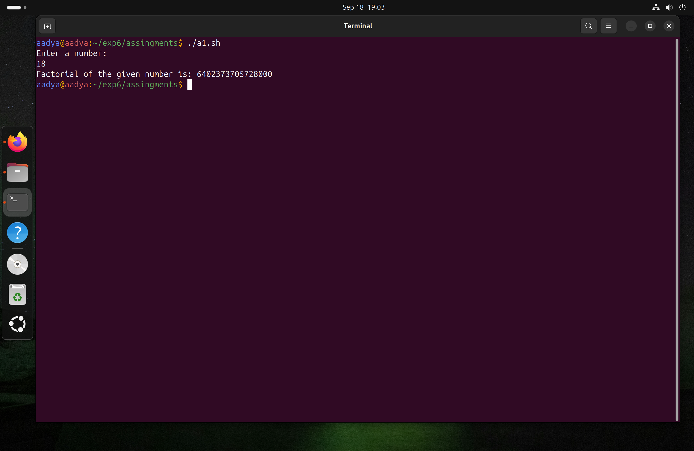
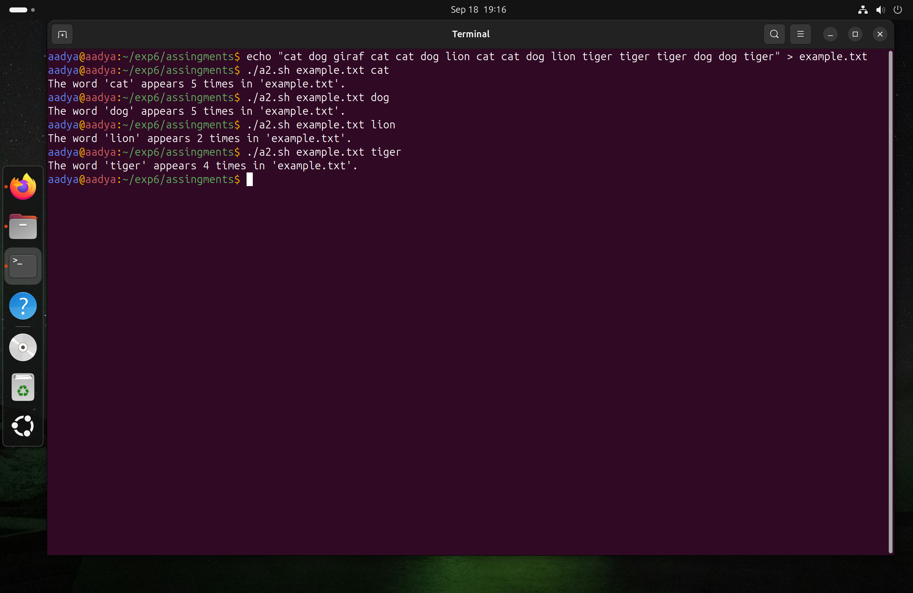
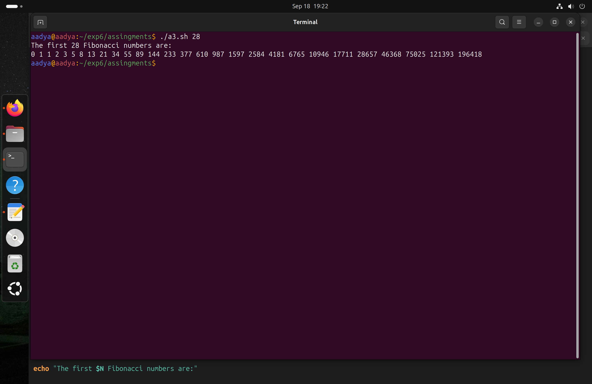
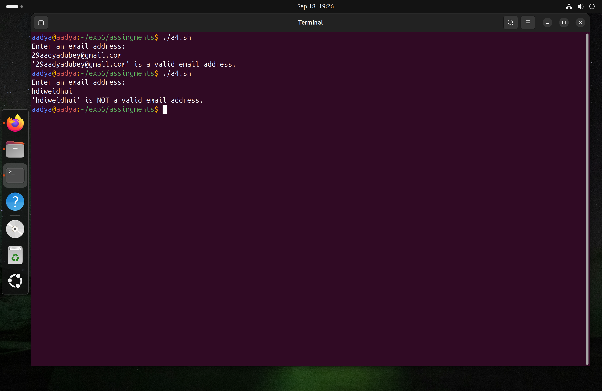
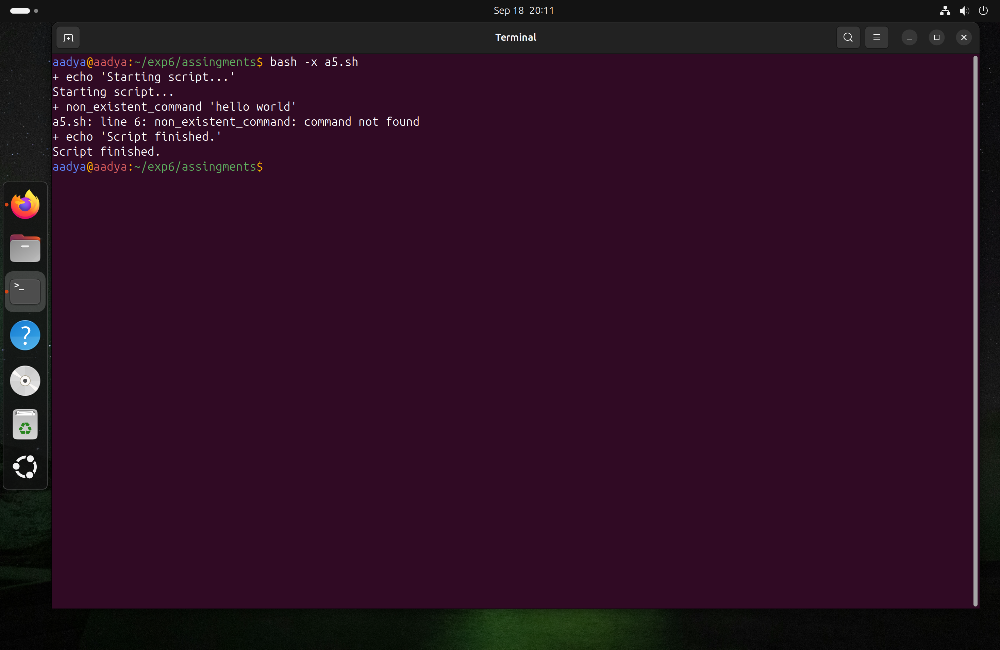

# Assignment 1
## 1. Write a function to calculate the factorial of a number using a loop.
### Script
```bash
#!/bin/bash
echo "Enter a number: "
read a

factorial=1
i=1
while [ $i -le $a ]
do
	factorial=$((factorial*i))
	i=$((i+1))
done

echo "Factorial of the given number is: $factorial"
```
### Output


## 2. Write a script that reads a filename and counts how many times a given word appears in it.
### Script
```bash
#!/bin/bash

if [ -z "$1" ] || [ -z "$2" ]; then
  echo "Usage: $0 <filename> <word_to_count>"
  exit 1
fi

filename="$1"
word_to_count="$2"

if [ ! -f "$filename" ]; then
  echo "Error: File '$filename' not found."
  exit 1
fi

count=$(grep -o -i -w "$word_to_count" "$filename" | wc -l)

echo "The word '$word_to_count' appears $count times in '$filename'."
```
### Output


## 3. Write a script that generates the first N Fibonacci numbers using a while loop.
### Script
```bash
#!/bin/bash

usage() {
    echo "Usage: $0 <number_of_fibonacci_numbers>"
    echo "Generates the first N Fibonacci numbers."
    exit 1
}

if [ -z "$1" ]; then
    usage
fi

N=$1

if ! [[ "$N" =~ ^[0-9]+$ ]] || [ "$N" -le 0 ]; then
    echo "Error: N must be a positive integer."
    usage
fi

a=0
b=1

count=0

echo "The first $N Fibonacci numbers are:"

if [ "$N" -ge 1 ]; then
    echo -n "$a "
    count=$((count + 1))
fi

if [ "$N" -ge 2 ]; then
    echo -n "$b "
    count=$((count + 1))
fi

while [ "$count" -lt "$N" ]; do
    fn=$((a + b)) 
    echo -n "$fn " 
    a=$b         
    b=$fn         
    count=$((count + 1))
done

echo "" 
```
### Output


## 4. Write a script that validates whether the entered string is a proper email address using a regular expression.
### Script
```bash
#!/bin/bash

regex="^[a-zA-Z0-9._%+-]+@[a-zA-Z0-9.-]+\.[a-zA-Z]{2,}$"

echo "Enter an email address:"
read email_address

if [[ "$email_address" =~ $regex ]]; then
  echo "'$email_address' is a valid email address."
else
  echo "'$email_address' is NOT a valid email address."
fi
```
### Output


## 5. Write a script with an intentional error, run it with `bash -x`, and explain the debug output.
### Script
```bash
#!/bin/bash

echo "Starting script..."

non_existent_command "hello world"

echo "Script finished."
```
### Output


**Explanation of the Debug Output:**  
* `+ echo 'Starting script...'`:
    * The `+` prefix indicates that this line is from the bash `-x` debug output.
    * echo `'Starting script...'` shows the command being executed after variable expansion (though no variables are present here). This is the first command in the script.
    
* `Starting script...`:
    * This is the actual output generated by the echo command from the script itself, printed to standard output.

* `+ non_existent_command 'hello world'`:
    * Again, the `+` prefix signifies debug output.
    * `non_existent_command 'hello world'` reveals the next command the shell is attempting to execute, along with its arguments. This is where the intentional error lies. 

* `my_script.sh: line 5: non_existent_command: command not found`:
    * This is the error message generated by Bash.
    * `my_script.sh: line 5:` indicates the script file and line number where the error occurred.
    `non_existent_command: command not found` clearly states the nature of the error: the command `non_existent_command` could not be found in the system's PATH.
* `+ echo 'Script finished.'`:
    * The `+` prefix indicates that this line is from the bash `-x` debug output.
    * echo `+ echo 'Script finished.'` shows the command being executed after variable expansion (though no variables are present here). This is the first command in the script.
* `Script finished.`:
    * This is the actual output generated by the echo command from the script itself, printed to standard output.

***
