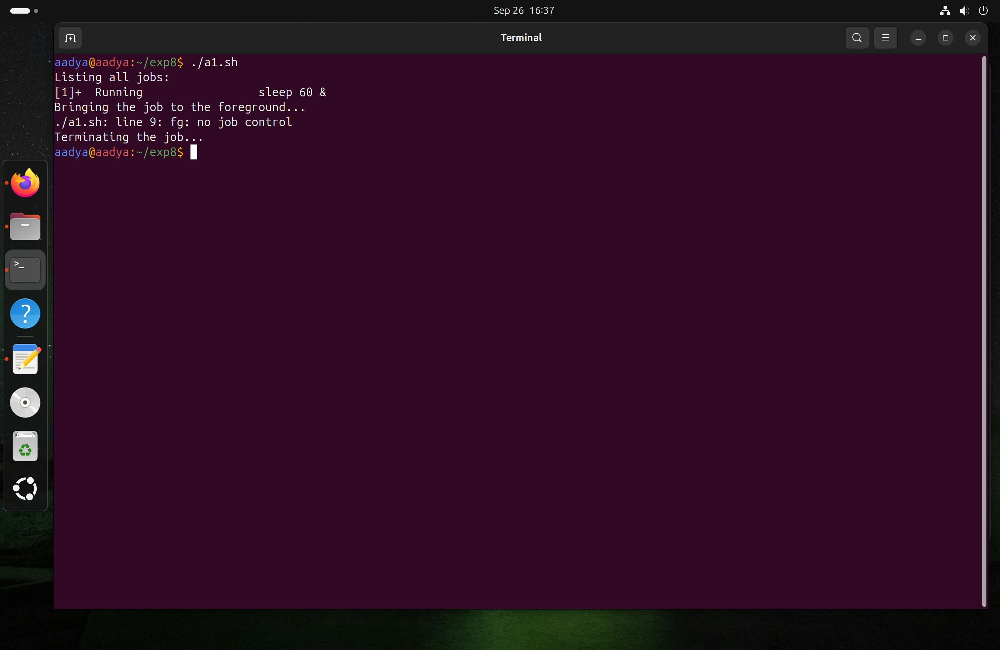
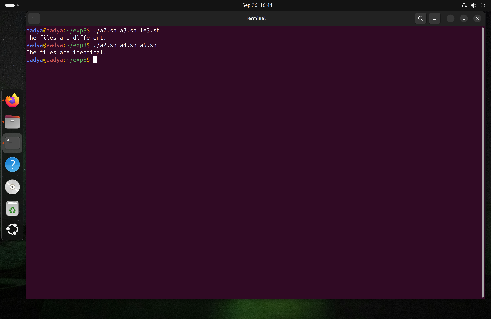
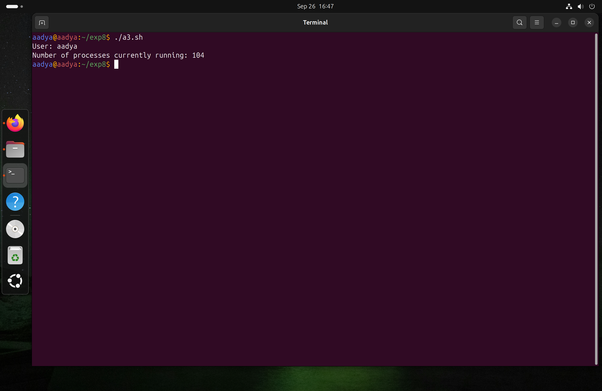
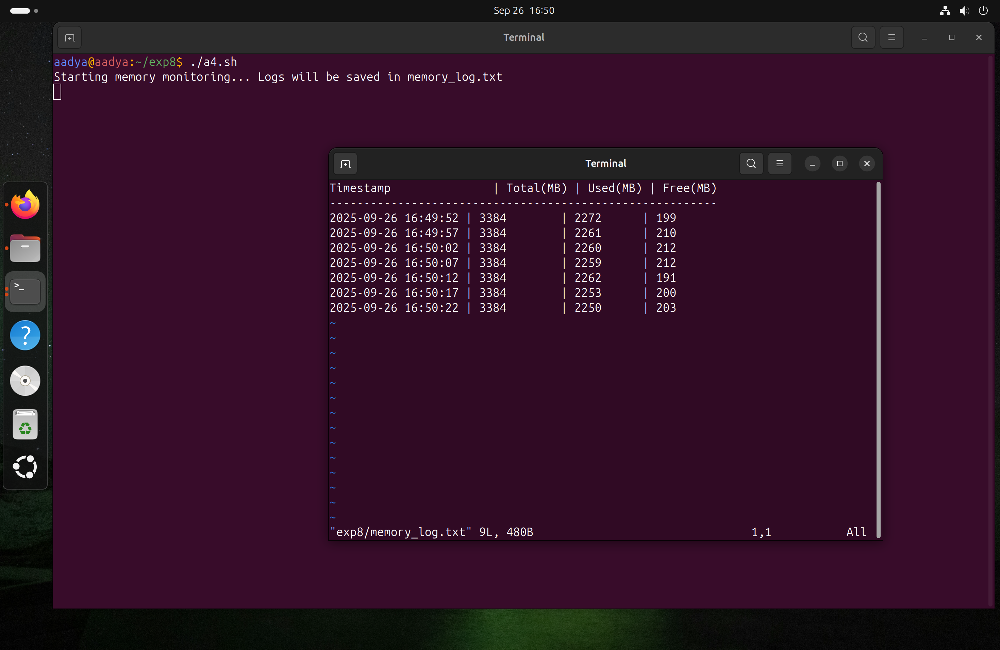
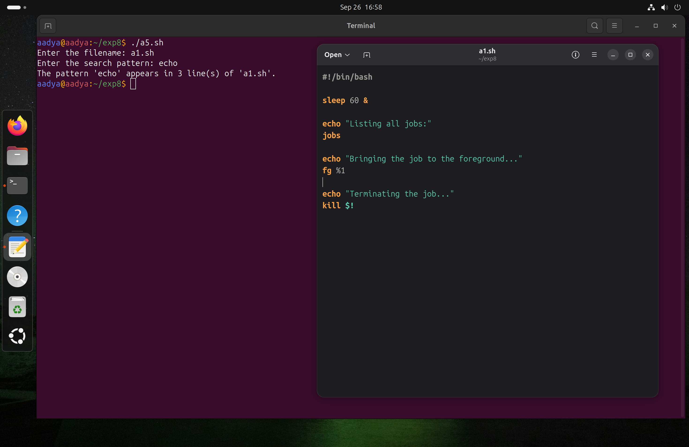

# Assignment 3
## 1. Write a script that starts a background job (e.g., sleep 60), lists all jobs, brings the job to the foreground, and then terminates it.
### Input
```bash
#!/bin/bash

sleep 60 &

echo "Listing all jobs:"
jobs

echo "Bringing the job to the foreground..."
fg %1

echo "Terminating the job..."
kill $!
```
### Output



## 2.  Create a script that compares two files and displays whether their contents are identical or different.  

### Input
```bash
#!/bin/bash

if [ $# -ne 2 ]; then
  echo "Usage: $0 <file1> <file2>"
  exit 1
fi

file1=$1
file2=$2

if [ ! -f "$file1" ] || [ ! -f "$file2" ]; then
  echo "Error: One or both files do not exist."
  exit 1
fi

if cmp -s "$file1" "$file2"; then
  echo "The files are identical."
else
  echo "The files are different."
fi
```
### Output



## 3. Write a script that counts the number of processes currently being run by your user.  

### Input
```bash
#!/bin/bash

count=$(ps -u $USER | wc -l)

count=$((count - 1))

echo "User: $USER"
echo "Number of processes currently running: $count"
```
### Output



## 4. Develop a script that monitors memory usage every 5 seconds and logs it into a file.  

### Input
```bash
#!/bin/bash

LOG_FILE="memory_log.txt"

echo "Starting memory monitoring... Logs will be saved in $LOG_FILE"
echo "Timestamp               | Total(MB) | Used(MB) | Free(MB)" > "$LOG_FILE"
echo "---------------------------------------------------------" >> "$LOG_FILE"

while true
do
    timestamp=$(date +"%Y-%m-%d %H:%M:%S")
    
    mem_info=$(free -m | grep Mem | awk '{print $2"        | "$3"      | "$4}')
    
    echo "$timestamp | $mem_info" >> "$LOG_FILE"
    sleep 5
done
```
### Output


## 5. Write a script that prompts for a filename and a search pattern, then displays the count of matching lines.  

### Input
```bash
#!/bin/bash

read -p "Enter the filename: " filename

if [ ! -f "$filename" ]; then
  echo "Error: File '$filename' does not exist."
  exit 1
fi

read -p "Enter the search pattern: " pattern

count=$(grep -c "$pattern" "$filename")

echo "The pattern '$pattern' appears in $count line(s) of '$filename'."
```
### Output



