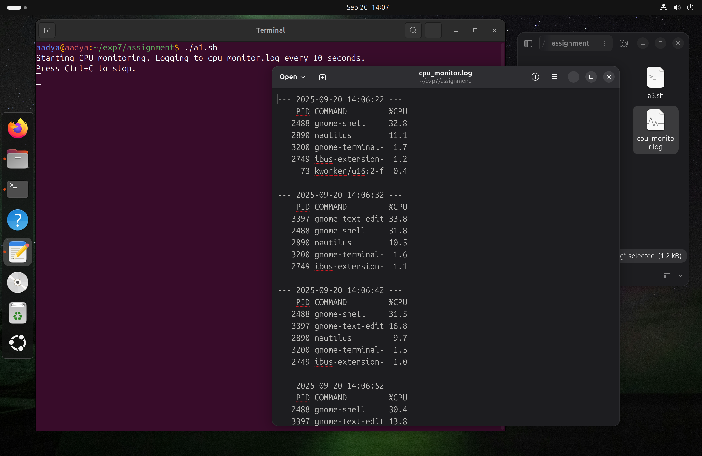

# Assignment 
## 1. Write a script that monitors the top 5 processes consuming the most CPU and logs them into a file every 10 seconds.
Hint: Use `ps -eo pid,comm,%cpu --sort=-%cpu | head -6`.
### Script
```bash
#!/bin/bash

LOG_FILE="cpu_monitor.log"
INTERVAL=10 

echo "Starting CPU monitoring. Logging to $LOG_FILE every $INTERVAL seconds."
echo "Press Ctrl+C to stop."

while true; do
  TIMESTAMP=$(date +"%Y-%m-%d %H:%M:%S")
  echo "--- $TIMESTAMP ---" >> "$LOG_FILE"
  ps -eo pid,comm,%cpu --sort=-%cpu | head -n 6 >> "$LOG_FILE"
  echo "" >> "$LOG_FILE"
  sleep "$INTERVAL"
done
```
###  Output


## 2.  Write a script that accepts a PID from the user and displays its details (state, parent process, memory usage).
Hint: Use `ps -p <PID> -o pid,ppid,state,comm,%mem`.
### Script
```bash
#!/bin/bash

read -p "Enter the PID: " pid

if ps -p "$pid" > /dev/null 2>&1; then
    echo "Process details:"
    ps -p "$pid" -o pid,ppid,state,comm,%mem
else
    echo "No process found with PID $pid"
fi
```
###  Output


## 3. Create a script that schedules a task to append the current date and time to a log file every minute using cron.
### Script
```bash
#!/bin/bash
LOG_FILE="/home/aadya/exp7/assignment/logfile.log" 
CURRENT_DATETIME=$(date +"%Y-%m-%d %H:%M:%S")
echo "$CURRENT_DATETIME" >> "$LOG_FILE"
```
Open crontab for editing,
```bash
crontab -e
```
In crontab,
```bash
* * * * * /home/aadya/exp7/assignment/logfile.log
```
###  Output


## 4. Modify the factorial function to check if input is negative. If yes, display an error message.
### Script
```bash
#!/bin/bash

factorial() {
  local num=$1
  local result=1

  if (( num < 0 )); then
    echo "Error: Factorial is not defined for negative numbers."
    return 1 
  fi

  if (( num == 0 )); then
    echo 1
  else
    for (( i=1; i<=num; i++ )); do
      result=$(( result * i ))
    done
    echo "$result"
  fi
}

read -p "Enter a non-negative integer: " input_num


fact_result=$(factorial "$input_num")

if [ $? -eq 0 ]; then
  echo "The factorial of $input_num is: $fact_result"
fi
```
###  Output


## 5. Write a script that accepts a filename as an argument. If the file exists, display the number of lines starting with a vowel.
Hint: Use `grep -i "^[aeiou]" filename | wc -l`.
### Script
```bash
#!/bin/bash

if [ -z "$1" ]; then
  echo "Usage: $0 <filename>"
  exit 1
fi

filename="$1"

if [ -f "$filename" ]; then
  vowel_count=$(grep -c '^[AEIOUaeiou]' "$filename")
  echo "Number of lines starting with a vowel in '$filename': $vowel_count"
else
  echo "Error: File '$filename' not found."
  exit 1
fi
```
###  Output


