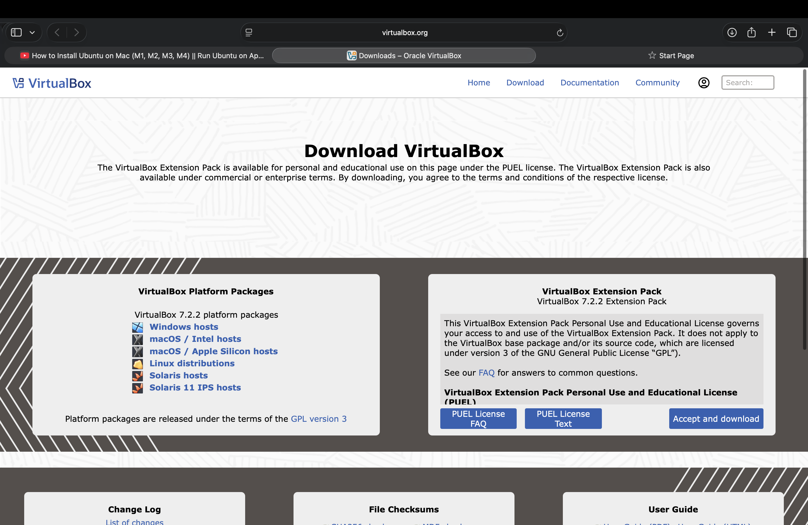
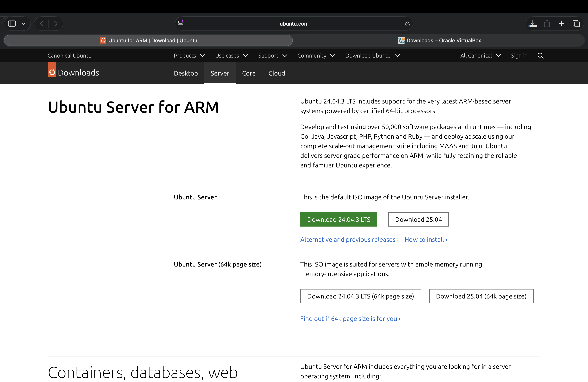
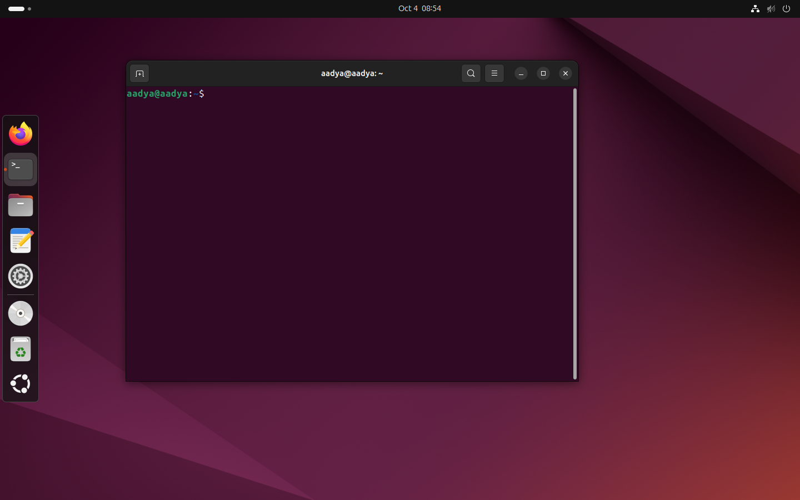
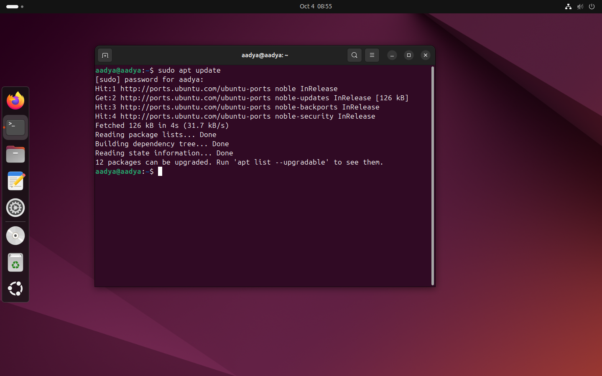

# Experiment 3: Linux File Manipulation and System Management Tutorial 
**Name:** Aadya Dubey  
**Roll No.:** 590029213  
**Date**:09/09/2025
***
# Aim: 
To install Oracle VirtualBox on a MacOs and set up a Linux operating system (Ubuntu/Fedora/etc.) to practice Linux commands and explore its environment in a virtual machine.

# Requirments:
* Host OS: MacOs Tahoe
* Virtualization Software: Oracle VirtualBox v7.2.0
* Guest OS: Ubuntu 24.04.03
***
***
# Procedure:
## Step 1: Download Oracle VirtualBox
* Go to [Download VirtualBox](https://www.virtualbox.org/wiki/Downloads).
* Install the package for Apple Sillicon Hosts.

## Step 2: Download an installation .iso for a Linux distribution like Ubuntu
* Go to [Download Ubuntu](https://ubuntu.com/download/server/arm)
* Download the 24.04.3 LTS server edition

## Step 3: Install Oracle VirtualBox on Mac
* Start the installer by double cliking on VitualBox file.

* Double click on the .pkg file to start the installer.

* Enter password/fingerprint for conpleting installation.

*  Go to applications folder and click on virtual box icon to open it.
## Step 4: Creating a new virtual machine for Ubuntu
* Click on creat a new virtual machine.

* After naming the machine select the iso image

* Write your username and password.

* Specify the virtual hardware and hard disk and click finish

* Instal and set up the Ubuntu 24.04 by following the installation prompts and providing the required information, such as username and password.

* After the installation is complete, we will have a fully functional Linux Virtual Machine running with VirtualBox.

* After installation make sure to update.

  

***

# OBERVATIONS
* Oracle VirtualBox was installed successfully without any issues.
* The Linux OS booted and installed properly inside the virtual machine.
* Terminal commands were executed successfully.

***

# CONCLUSION
The experiment helped me install and configure Oracle VirtualBox and set up a Linux operating system in a virtual environment.

***