# Experiment 2: Linux file systems and permissions and essential 
**Name:** Aadya Dubey  
**Roll No.:** 590029213
***
# Aim: 
To understand the structure of the Linux file system, manage file permissions and ownership, and practice essential Linux commands.
# Requirments:
* Operating System: Ubuntu running on Oracle VirtualBox
* Shell: Bash (Bourne-Again Shell)
***
***
## Linux file system
Linux uses tree like directory system starting from the root directory `/`

Example structure:
```bash
/
├── home/
│   ├── john/
│   └── mary/
├── usr/
├── etc/
└── var/
```
***
## File permisions and ownership
In this topic will learn about various file permissions and diffrent kinds of ownerships assigned to the users.
### 1. Permission types
There are 3 types of permissions:  
`r` - stands for **read**, gives permission to view the file  
`w` - stands for **write**, gives permission to edit the file  
`x` - stands for **execute**, gives permission to execute the file  
### 2. User Types
There are 3 types of user types:  
Owner - the user who owns the file  
Group - Users in the same group as the owner  
Others - everyone else  
### 3. Reading permission format
```rwxr-xr--```

Here first 3 characters are permissions of owner and next three characters are permissions of group and the last three characters are permissions of other users.
### 4. Modifying permissions
We can modify permissions using `chmod` command as shown bellow:  
```bash
# Give execute permission to owner
chmod u+x filename

# Remove write permission from group
chmod g-w filename

# Set specific permissions using numbers
chmod 755 filename  # rwxr-xr-x
chmod 644 filename  # rw-r--r--
```
**Permission numbers:**
* 4 = read (r)
* 2 = write (w)
* 1 = execute (x)
* Add them together: 7 = rwx, 5 = r-x, 5 = r-x, etc.
### 5. Changing ownership
Use `chown` command for changing ownership.
```bash
# Change owner
sudo chown newowner filename

# Change owner and group
sudo chown newowner:newgroup filename

# Change only group
sudo chgrp newgroup filename
```
***
## Basic command navigation
Essential commands for moving around Linux system.  
### 1. `ls` -List directory contents
List all the contents of the mentioned directory/directories.  
Basic usage:
```bash
# List files in current directory
ls

# List with detailed information
ls -l

# List all files including hidden ones
ls -a

# Combine options for detailed view with hidden files
ls -la
```
Output of 
```bash
ls
ls -l
ls -la /home
```
Is given bellow,

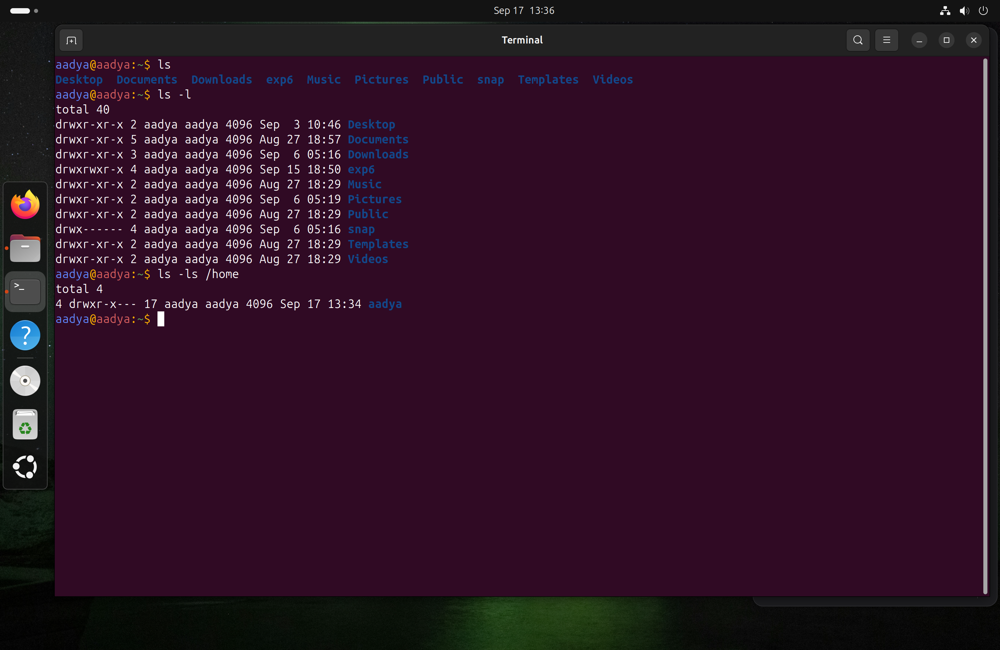


### 2. `pwd` - Print working directory
Prints the location of directory we are currently working in.  

Output of
```bash
pwd
```
Is given bellow,  

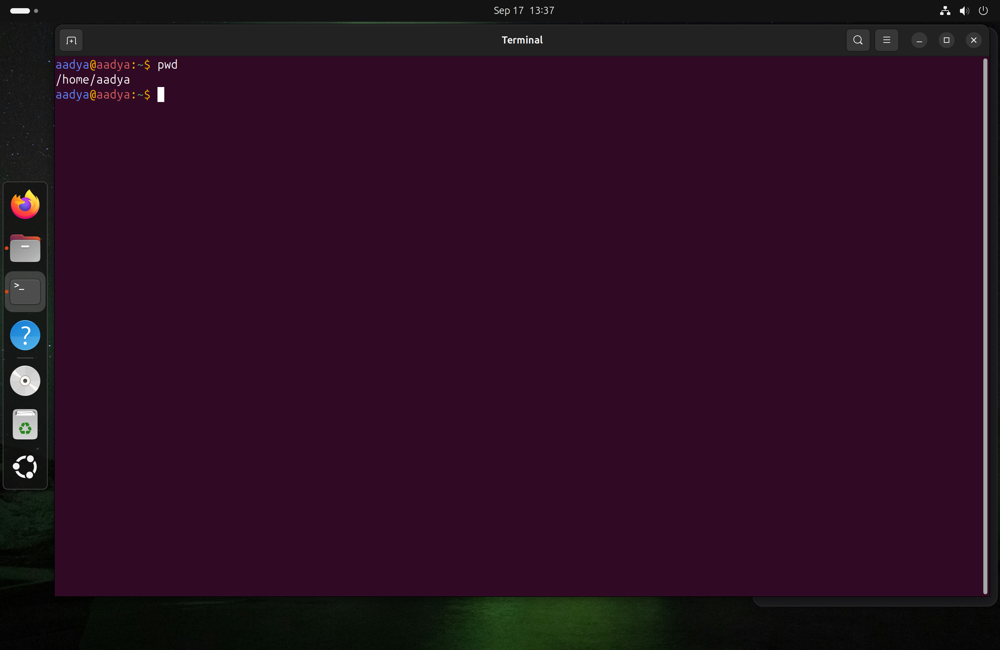


### 3. `cd` - Change Directory
Basic usage:
```bash
# Go to home directory
cd

# Go to a specific directory
cd /home/username/Documents

# Go up one level
cd ..

# Go up two levels
cd ../..

# Go to previous directory
cd -

# Go to root directory
cd /
```

Output of 
```bash
pwd                    # See where you are
cd /                  # Go to root
pwd                   # Confirm you're at root
ls                    # Look around
cd home               # Go to home directory
ls                    # See user directories
cd                    # Go to your home
pwd                   # Confirm location
```
is given below,  
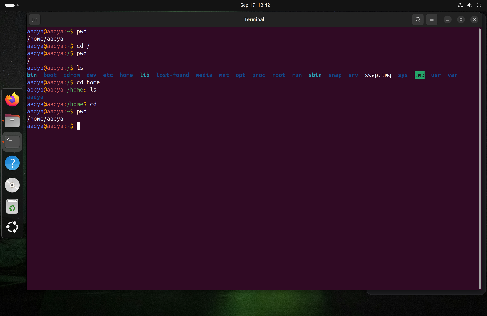

### 4. `mkdir` - Make Directory
Creates new directories/folders.
```bash
# Create a single directory
mkdir myfolder

# Create multiple directories
mkdir folder1 folder2 folder3

# Create nested directories
mkdir -p documents/projects/linux_tutorial

# Create directory with specific permissions
mkdir -m 755 public_folder
```
Output of 
```bash
cd                           # Go to home
mkdir practice_linux         # Create practice folder
cd practice_linux           # Enter the folder
mkdir files documents scripts
ls                          # See what you created
```
is given below,  
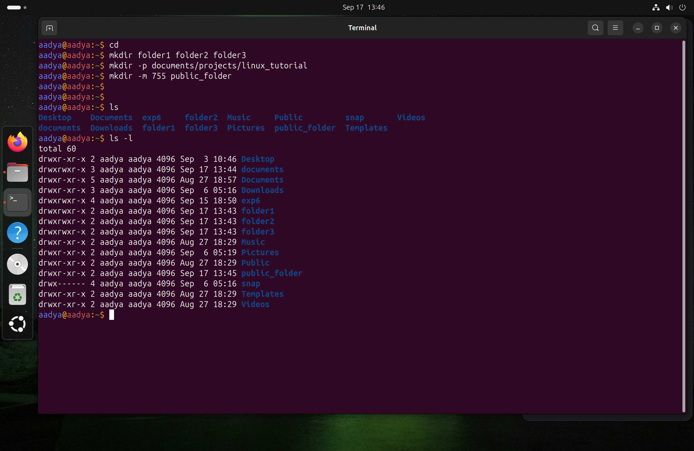
### 5. `rmdir` - Remove Directory
 Remove empty directory only.
 ```bash
# Remove empty directory
rmdir empty_folder

# Remove multiple empty directories
rmdir folder1 folder2

# Try to remove nested empty directories
rmdir -p path/to/empty/directories
 ```
For directories with content use `rm -r` (more about this later).
***
## File Operations
### 1. `touch` - Create files
Creates empty files or update timestamps of existing files.
```bash
# Create a single file
touch myfile.txt

# Create multiple files
touch file1.txt file2.txt file3.txt

# Create file with current timestamp
touch document_$(date +%Y%m%d).txt
```
Output of 
```bash
cd ~/practice_linux/files
touch readme.txt notes.txt log.txt
ls -l                        # See the files you created
```
is given below,  
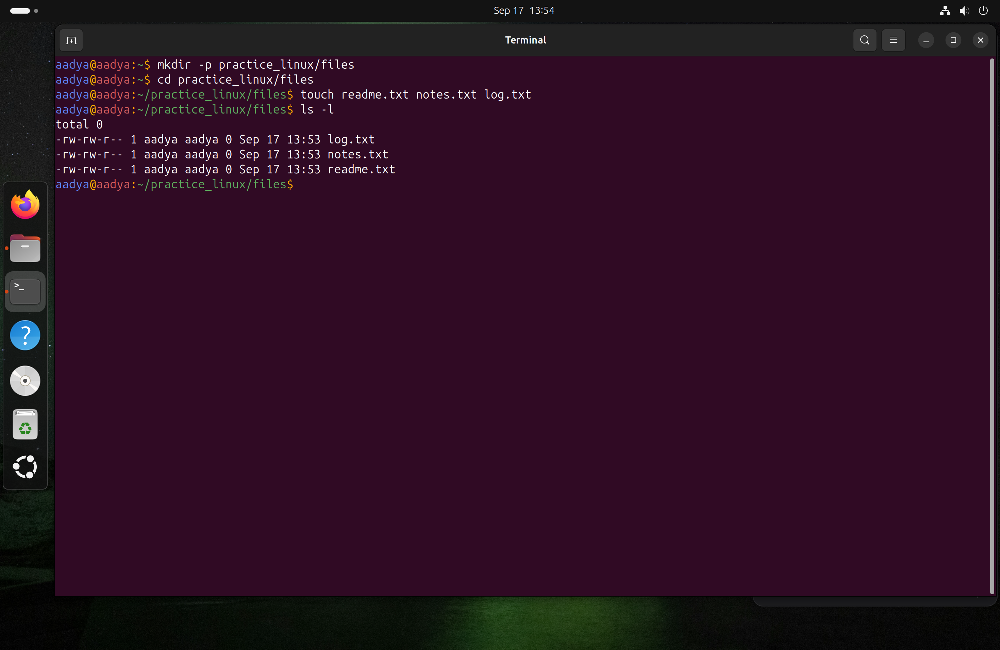
### 2. `cp` - Copy file and directories
Basic file copying:
```bash
# Copy a file
cp source_file destination_file

# Copy file to different directory
cp myfile.txt ~/documents/

# Copy with a new name
cp original.txt backup_original.txt
```
Directory copying:
```bash
# Copy directory and its contents
cp -r source_directory destination_directory

# Copy with preserve attributes
cp -p file.txt backup_file.txt
```
Output of
```bash
cd ~/practice_linux
echo "This is my first Linux file" > files/readme.txt
cp files/readme.txt documents/
cp files/readme.txt documents/readme_backup.txt
cp -r files backup_files
ls -la documents
ls -la backup_files
```
is given below,  

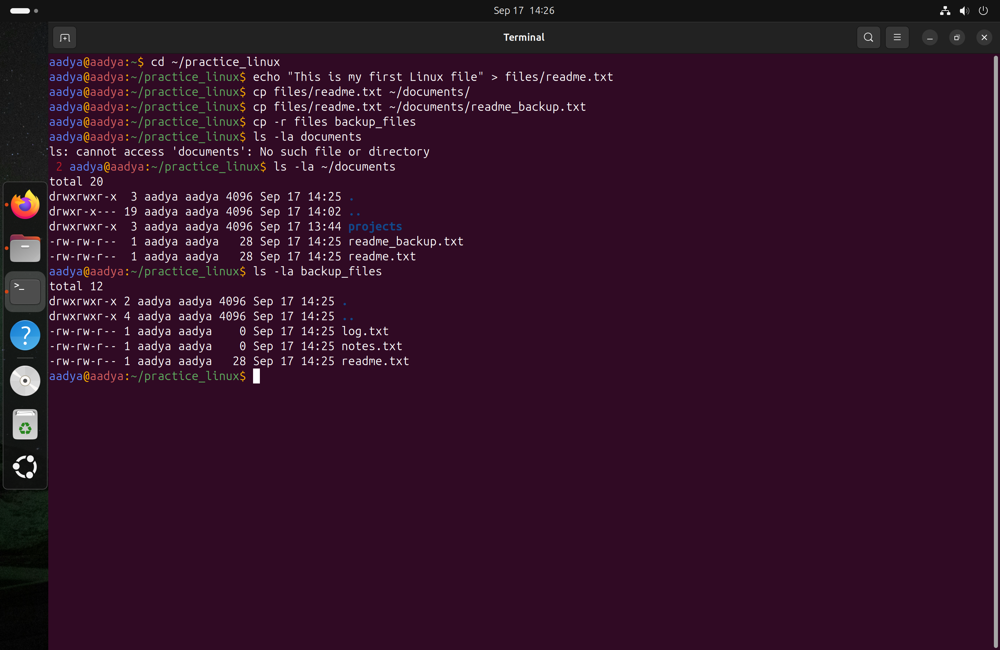
### 3. `mv` - Move and Rename
Moving files:
```bash
# Move file to different directory
mv file.txt ~/documents/

# Move multiple files
mv file1.txt file2.txt ~/documents/
```
Renaming files:
```bash
# Rename a file
mv oldname.txt newname.txt

# Rename directory
mv old_folder new_folder
```
Output of 
```bash
cd ~/practice_linux/files
touch temp_file.txt
mv temp_file.txt important_file.txt
ls
mv important_file.txt ../documents/
ls ../documents/
```
is given below,  

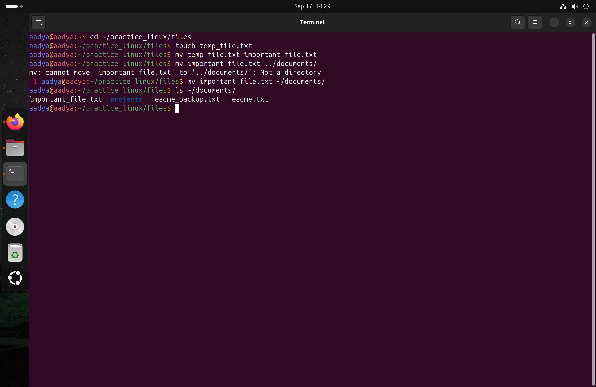

### 4. `rm` - Remove Files and Directories
**Warning** - Be very careful with `rm` command files and directories are not recoverable once removed.
Basic usage:
```bash
# Remove a file
rm filename.txt

# Remove multiple files
rm file1.txt file2.txt

# Remove directory and contents (be careful!)
rm -r directory_name

# Force remove (no confirmation)
rm -f filename.txt

# Interactive removal (asks for confirmation)
rm -i filename.txt
```
Safe practice:
```bash
cd ~/practice_linux
touch test_delete.txt
ls
rm -i test_delete.txt       # Type 'y' to confirm
ls                          # Confirm it's gone
```
***
## File Viewing and Editing
### 1. `cat` - Display file contents
Basic usage:
```bash
# Display entire file content
cat filename.txt

# Display multiple files
cat file1.txt file2.txt

# Display with line numbers
cat -n filename.txt

# Create a file with cat (Ctrl+D to save)
cat > newfile.txt
```
Output of
```bash
cd ~/practice_linux
echo "Line 1: Hello Linux" > sample.txt
echo "Line 2: Learning commands" >> sample.txt
echo "Line 3: This is fun!" >> sample.txt
cat sample.txt
cat -n sample.txt
```
is given below,  

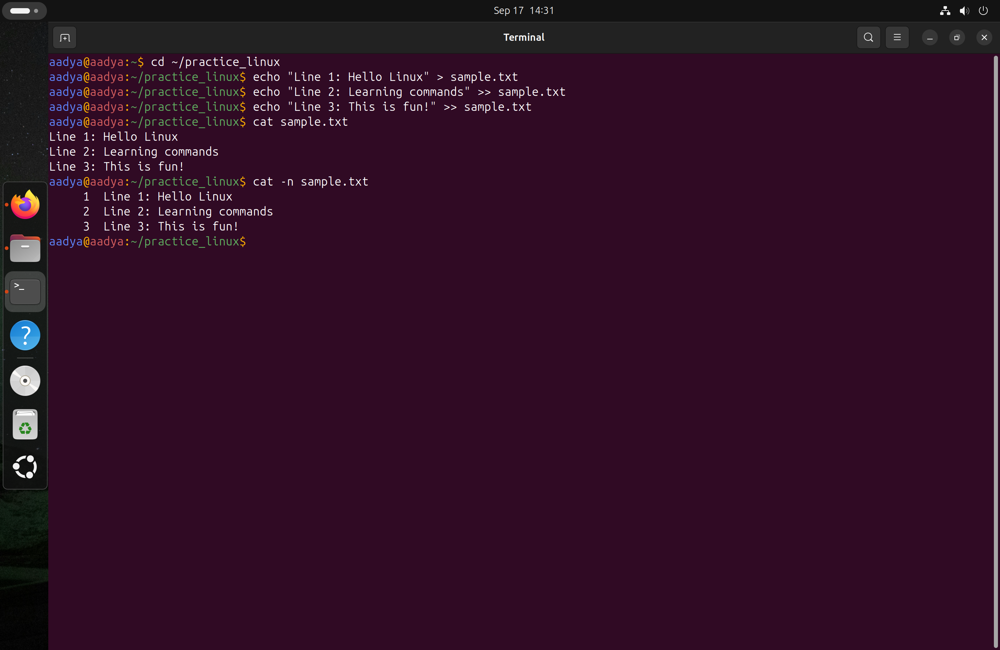

### 2. `less` and `more` - Paginated Viewing
Better for viewing larger files.  
**Using `less`:**
```bash
less filename.txt
```
Navigation in `less`:  
* `space` - Next page
* `b` - Previous page
* `q` - Quit
* `/search_term` - Search forward  
* `?search_term` - Search backward

**Using `more`:**
```bash
more filename.txt
```
Navigation in `more`:
* `space` - Next page
* `q` - Quit
### 3. `head` and `tail` - Partial file viewing
`head` - Show begininig of file:
```bash
# Show first 10 lines (default)
head filename.txt

# Show first 5 lines
head -n 5 filename.txt

# Show first 20 characters
head -c 20 filename.txt
```
`tail`  - Show end of the file
```bash
# Show last 10 lines (default)
tail filename.txt

# Show last 15 lines
tail -n 15 filename.txt

# Follow file changes (useful for logs)
tail -f logfile.txt
```
Output of
```bash
cd ~/practice_linux
# Create a larger file for testing
seq 1 100 > numbers.txt
head numbers.txt
head -n 5 numbers.txt
tail numbers.txt
tail -n 3 numbers.txt
```
is given below,  
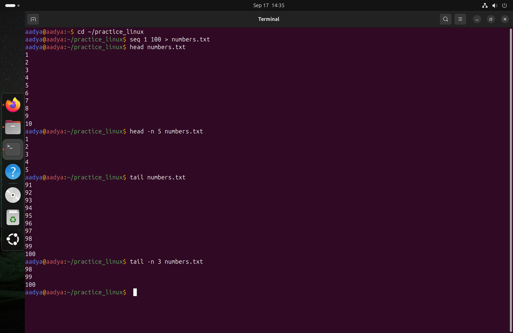

### 4. Text Editors: `nano` and `vim`
**Using `nano` (Beginner-friendly)**
```bash
# Open/create file in nano
nano filename.txt
```
Nano shortcuts:
* `Ctrl + O` - Save file
* `Ctrl + X` - Exit nano
* `Ctrl + W` -  Search
* `Ctrl + K` - Cut line  
*  `Ctrl + U` - Paste line

Output of
```bash
cd ~/practice_linux
nano my_first_edit.txt
```
Type some text, press `Ctrl+O` to save, then `Ctrl+X` to exit.  

is given below,  

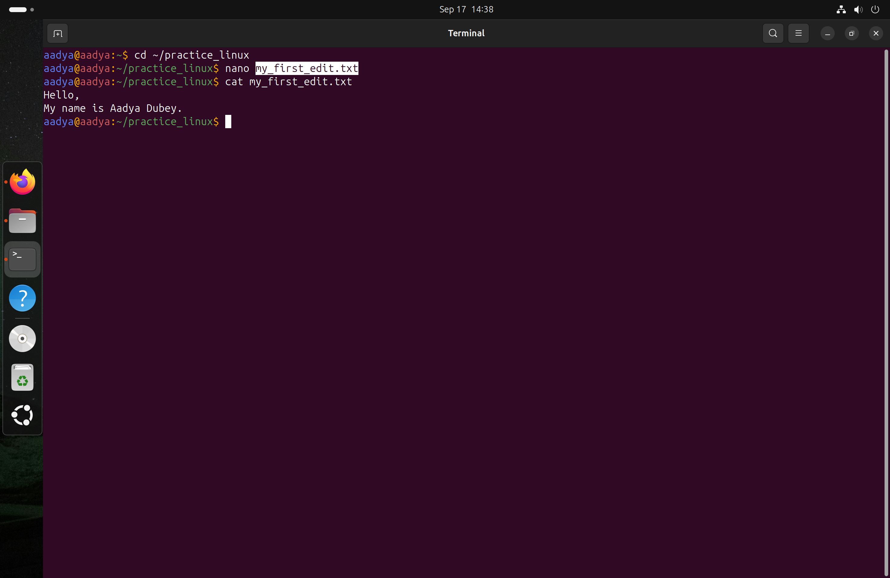


**Using `vim` (Advanced but powerful)**
```bash
# Open file in vim
vim filename.txt

```
Basic `vim` commands:
* `i` - Enter insert mode
* `ecp` - Exit insert mode
* `:w` - Save
* `:q` - Quit
* `:wq` - Save and quit
* `:q!` - Quit without saving

Output of
```bash
vim quick_test.txt
```
1. Press `i` to enter insert mode
2. Type "I am using vim text editor."
3. Press `esc` to exit insert mode
4. Type `:wq` and press enter

is given below,  

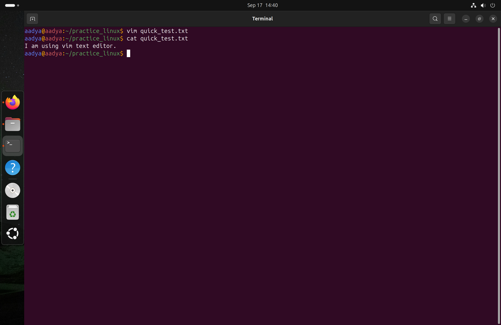

***
## User Management
Learn about users and permissions.
### 1. `whoami` - Current User
Shows your current username.
```bash
whoami
```
### 2. `who` - Logged in users
Shows all users currently loged into the system.
```bash
who

# More detailed information
w
```
### 3. `passwd` - Change Password
Change your user password.
```bash
passwd
```
You'll be promted to enter your current password and then the new password.
### 4. `sudo` - Execute as Administrator
Run commands with administrative privileges.
```bash
# Update system packages (example)
sudo apt update

# Edit system file
sudo nano /etc/hosts

# Switch to root user
sudo su -

# Run command as different user
sudo -u username command
```
**Important `sudo` practices:**
* Only use when necessary
* Be careful with system files
* Understand what command does before executing with `sudo`
* ***
## System Information
Learn to gather information about your Linux system.
### 1. `uname` - System Information
```bash
# Basic system info
uname

# All information
uname -a

# Kernel version
uname -r

# Machine hardware
uname -m

# Operating system
uname -o
```
### 2. `df` - Disk Space Usage
```bash
# Basic disk usage
df

# Human-readable format
df -h

# Specific filesystem
df -h /
```
Example output:
```bash
Filesystem      Size  Used Avail Use% Mounted on
/dev/sda1        20G  5.5G   13G  30% /
```
### 3. `top` and `htop` - Process Monitoring
**Using `top`:**
```bash
top
```
* `q` - Quit
* `k` - Kill
* `M` - Sort by memory usage
* `P` - Sort by CPU usage

**Using `htop`:**
```bash
htop
```
More user friendly the `top` with color coding and easier navigation.
### 4. `history` - Command History
```bash
# Show command history
history

# Show last 20 commands
history 20

# Search history
history | grep "search_term"

# Execute previous command
!!

# Execute command from history by number
!123
```

***
## Practice Exercises
Lets put everything together with some practical exercises.

### Exercise 1: File System Navigation
```bash
# 1. Go to your home directory
cd

# 2. Check your current location
pwd

# 3. Create a project structure
mkdir -p projects/linux_practice/{scripts,documents,backup}

# 4. Navigate to the scripts folder
cd projects/linux_practice/scripts

# 5. Create some files
touch setup.sh cleanup.sh readme.txt

# 6. List the files with details
ls -la

# 7. Go back to linux_practice directory
cd ..

# 8. List all subdirectories
ls -la
```

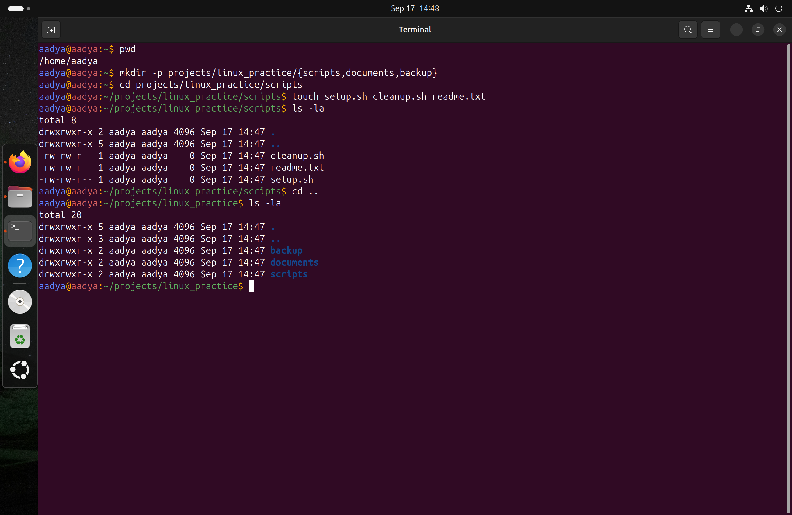


### Exercise 2: File Operations and Permissions
```bash
# 1. Go to documents folder
cd ~/projects/linux_practice/documents

# 2. Create a text file
echo "This is a practice document" > practice.txt

# 3. Check current permissions
ls -l practice.txt

# 4. Make it readable by everyone
chmod 644 practice.txt

# 5. Copy to backup folder
cp practice.txt ../backup/

# 6. Create a backup with timestamp
cp practice.txt ../backup/practice_backup_$(date +%Y%m%d).txt

# 7. List backup folder contents
ls -la ../backup/
```

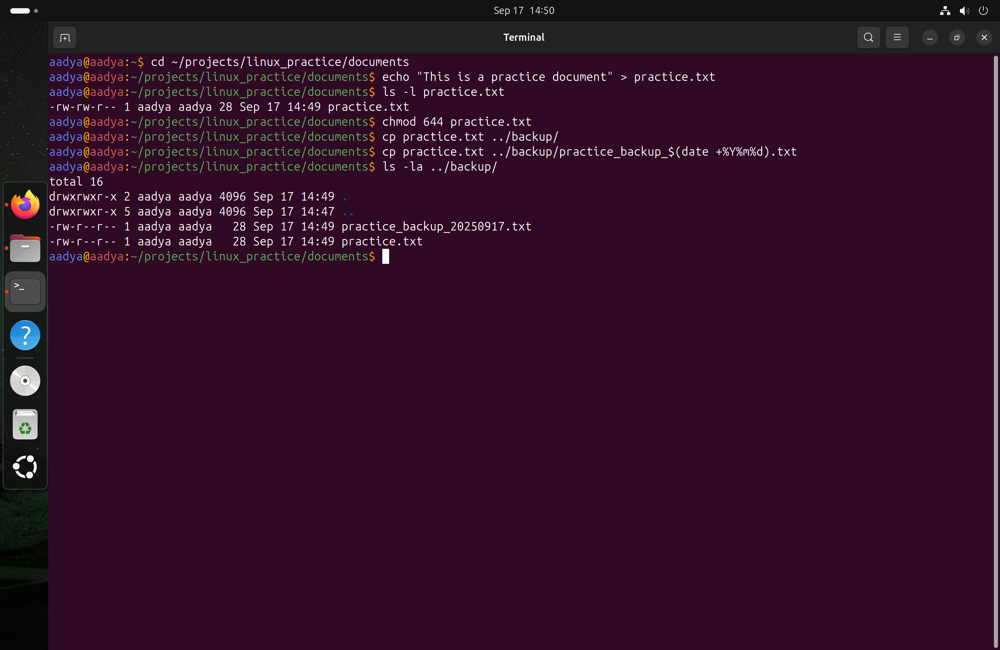


### Exercise 3: Text Editing and Viewing
```bash
# 1. Create a larger file for practice
cd ~/projects/linux_practice/documents
seq 1 50 > numbers.txt

# 2. View first 10 lines
head numbers.txt

# 3. View last 5 lines
tail -n 5 numbers.txt

# 4. Search for specific number
cat numbers.txt | grep "25"

# 5. Edit the file with nano
nano numbers.txt
# Add a comment at the top: "# Number list from 1 to 50"
# Save with Ctrl+O, exit with Ctrl+X

# 6. View the modified file
cat numbers.txt
```

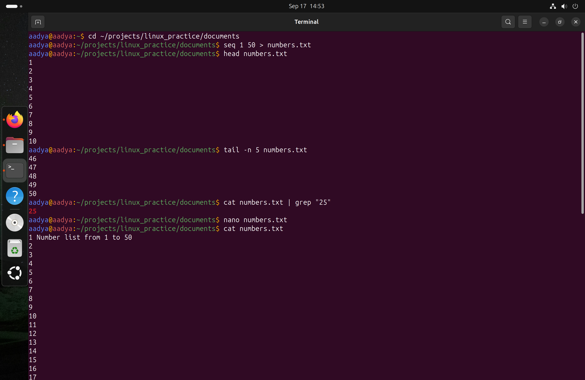

### Exercise 4: System Exploration
```bash
# 1. Check system information
uname -a

# 2. Check disk usage
df -h

# 3. See your recent commands
history 10

# 4. Check who's logged in
who

# 5. Find your username
whoami

# 6. Check current processes (press 'q' to quit)
top
```

 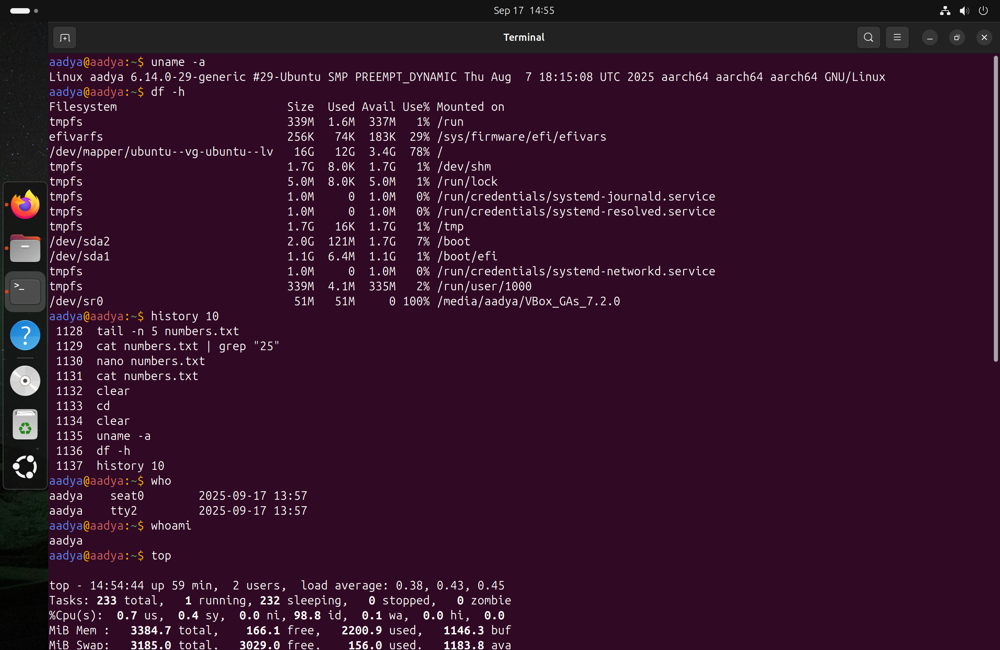  
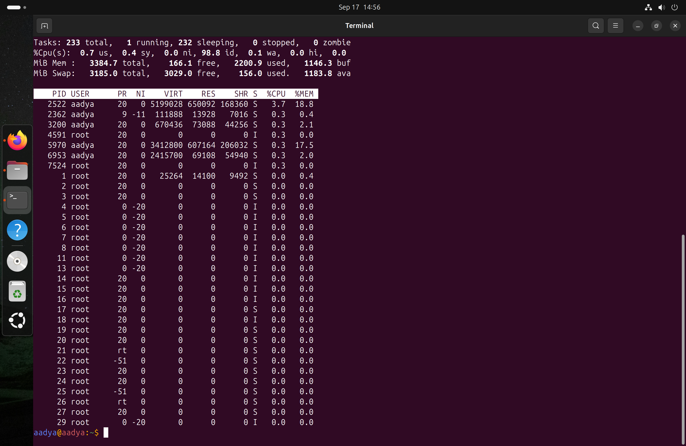


### Exercise 5: Cleanup
```bash
# 1. Go to practice directory
cd ~/projects/linux_practice

# 2. Remove a test file safely
rm -i documents/numbers.txt

# 3. Remove empty directory (if any)
# First try: rmdir backup  # This might fail if not empty
# Then: rm -r backup       # This removes directory and contents

# 4. List what remains
ls -la

# 5. Check history of your session
history | tail -20
```

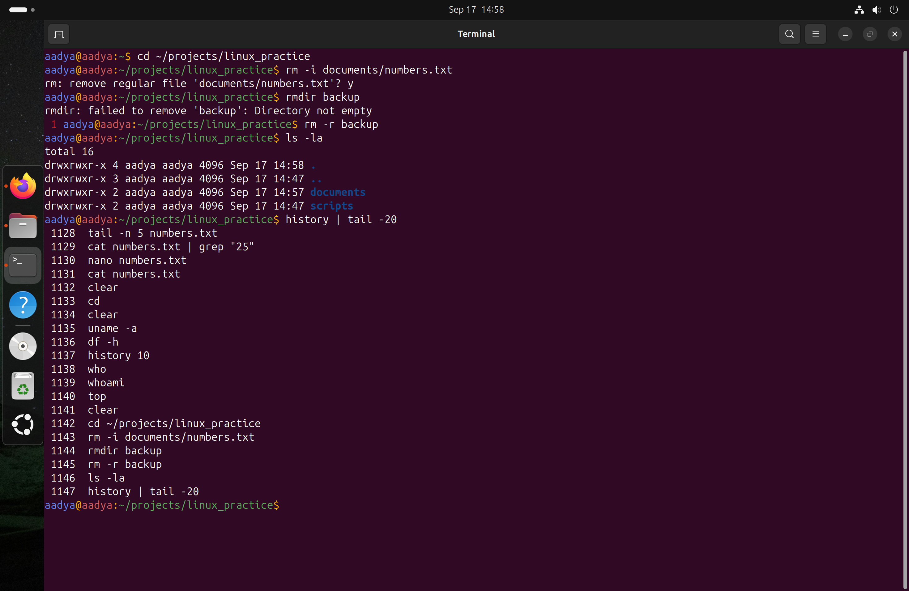
***

# OBERVATIONS

* The Linux file system structure was explored using commands.

* File permissions and ownership were checked and modified.

* Directories were navigated, and file operations were performed.

* File contents were viewed and edited with text editors.

* User management tasks were carried out using appropriate commands.

* System information and resource usage were monitored during the experiment.
***

# CONCLUSION

The experiment provided practical experience in using various Linux commands related to file systems, permissions, navigation, file operations, editing, user management, and system monitoring.
***


