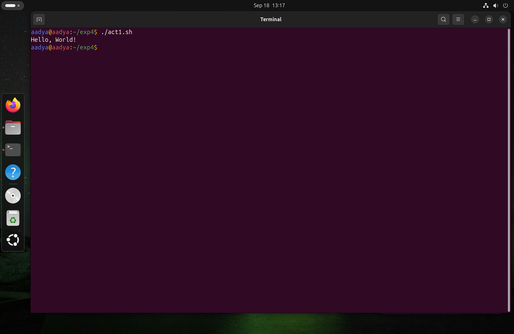
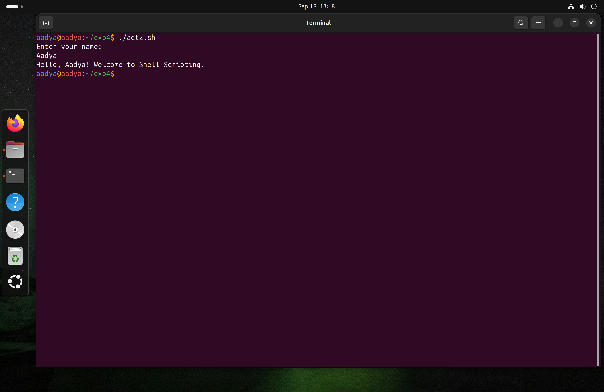
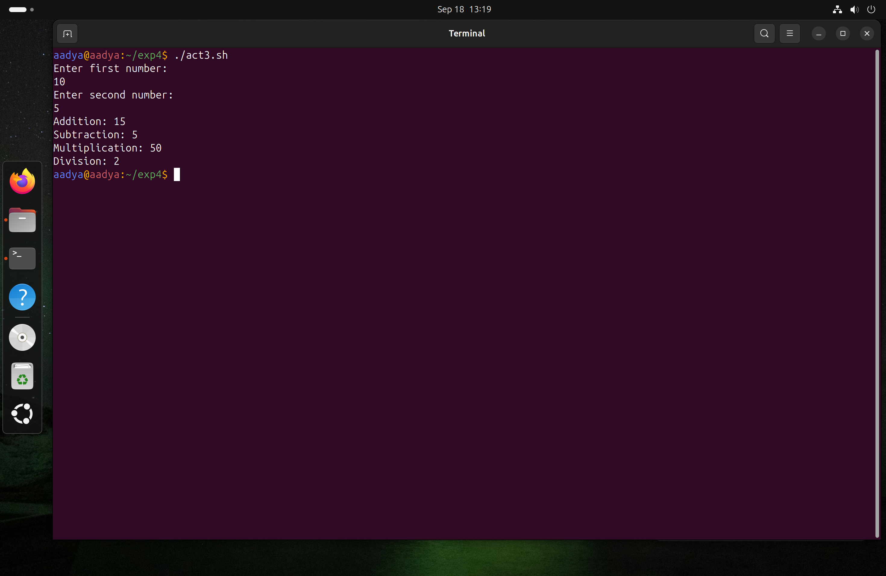
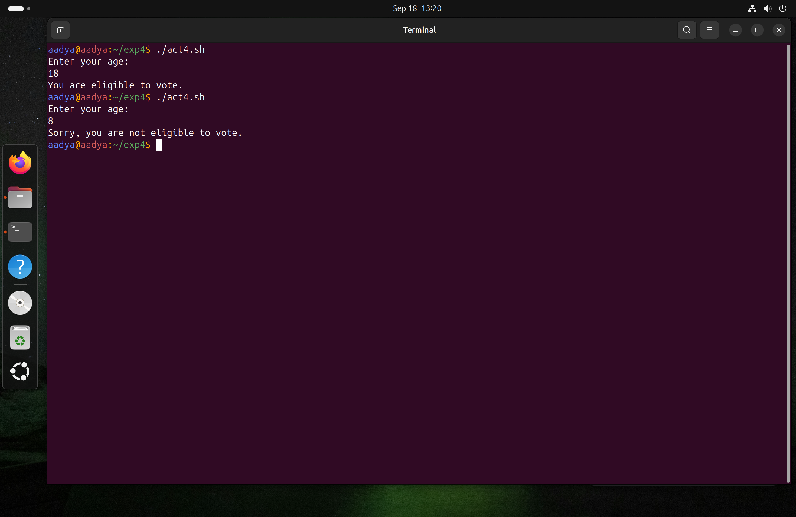

# Experiment 4: Shell Programming 
**Name:** Aadya Dubey  
**Roll No.:** 590029213  
**Date**:15/09/2025
***
# Aim: 
To learn the fundamentals of Shell Scripting in Linux

# Requirments:
* Operating System: Ubuntu running on Oracle VirtualBox
* Shell: Bash (Bourne-Again Shell)
***
***

## Lab Tasks
### i. Hello World Script
#### Script
```bash
#!/bin/bash
echo "Hello, World!"
```
#### Output


### ii. Personalized Greeting
#### Script
```bash
#!/bin/bash
echo "Enter your name: "
read name     # 'read' takes user input
echo "Hello, $name! Welcome to Shell Scripting."
```
#### Output


### iii. Arithmetic Operations
#### Script
```bash
#!/bin/bash
echo "Enter first number: "
read num1
echo "Enter second number: "
read num2

echo "Addition: $((num1 + num2))"
echo "Subtraction: $((num1 - num2))"
echo "Multiplication: $((num1 * num2))"
echo "Division: $((num1 / num2))"
```
#### Output
* `$(())` is arithmetic expansion in bash.


### iv. Voting Eligibility
#### Script
```bash
#!/bin/bash
echo "Enter your age: "
read age

if [ $age -ge 18 ]
then
    echo "You are eligible to vote."
else
    echo "Sorry, you are not eligible to vote."
fi
```
* `if [ condition ]` → condition enclosed in `[ ]`
*  `-ge` means **greater than or equal**.
#### Output


***

# OBERVATIONS
* Successfully created and executed multiple shell scripts in Bash.
* The "Hello, World!" script verified the basic structure of a shell program.
* Personalized greeting script demonstrated user input handling.
* Arithmetic script correctly performed addition, subtraction, multiplication, and division on user-provided numbers.
* Voting eligibility script applied conditional statements to evaluate user input.

***

# CONCLUSION
The experiment provided hands-on practice with Bash shell scripting, covering the essentials of input/output, variables, arithmetic, and conditional logic.

***
