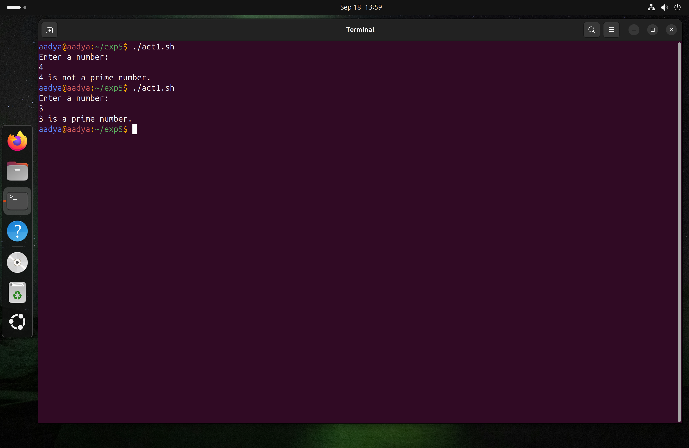
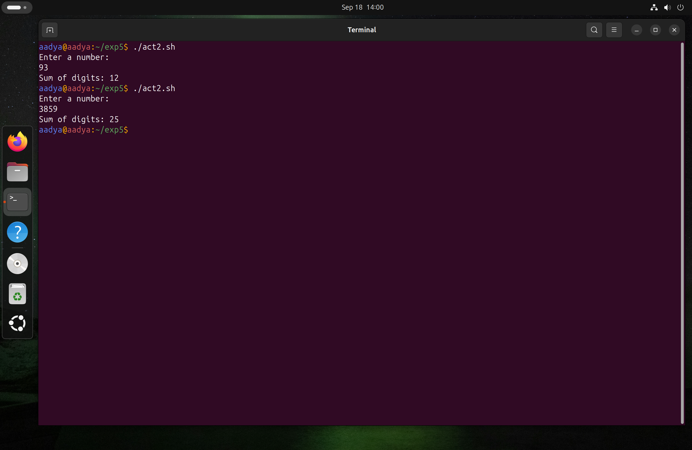
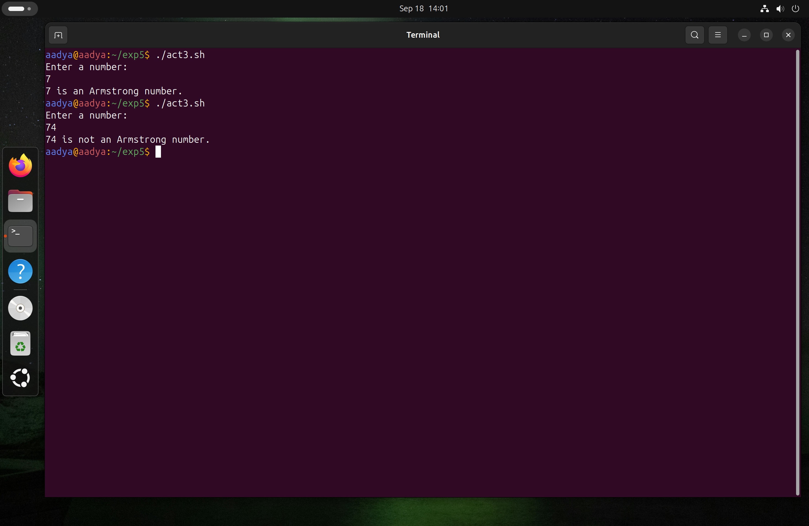

# Experiment 5: Shell Programming
**Name:** Aadya Dubey  
**Roll No.:** 590029213  
**Date**:19/09/2025
***
# Aim: 
To learn the Conditional statements, Loops and decision making in Shell scripting.

# Requirments:
* Operating System: Ubuntu running on Oracle VirtualBox
* Shell: Bash (Bourne-Again Shell)
***
***

## Lab Tasks
### i. Prime Number Check
#### Script
```bash
#!/bin/bash
echo "Enter a number: "
read num
flag=0

for ((i=2; i<=num/2; i++))
do
    if [ $((num % i)) -eq 0 ]
    then
        flag=1
        break
    fi
done

if [ $flag -eq 0 ]
then
    echo "$num is a prime number."
else
    echo "$num is not a prime number."
fi
```
#### Output


### ii. Sum of Digits
#### Script
```bash
#!/bin/bash
echo "Enter a number: "
read num
sum=0

while [ $num -gt 0 ]
do
    digit=$((num % 10))
    sum=$((sum + digit))
    num=$((num / 10))
done

echo "Sum of digits: $sum"
```
#### Output


### iii. Armstrong Number

(An Armstrong number of n digits is a number equal to the sum of its digits raised to the power n. Example: 153 = 1³ + 5³ + 3³)
#### Script
```bash
#!/bin/bash
echo "Enter a number: "
read num
temp=$num
n=${#num}   # number of digits
sum=0

while [ $temp -gt 0 ]
do
    digit=$((temp % 10))
    sum=$((sum + digit**n))
    temp=$((temp / 10))
done

if [ $sum -eq $num ]
then
    echo "$num is an Armstrong number."
else
    echo "$num is not an Armstrong number."
fi
```
#### Output


***

# OBERVATIONS
* The prime number script correctly identified whether the input number was prime or not.

* The sum of digits script accurately calculated the sum of digits for all tested inputs.

* The Armstrong number script successfully verified if a number was an Armstrong number.

* Conditional statements (if, else) worked as expected to control the flow of the scripts.

* Loops (for, while) efficiently handled repetitive operations like digit extraction and number checking.
***

# CONCLUSION
* Conditional statements and loops were effectively used in all scripts.

* The tasks proved that decision-making in shell scripting can be applied to solve mathematical problems.

* The experiment enhanced understanding of logic implementation in Linux shell scripting.


***
