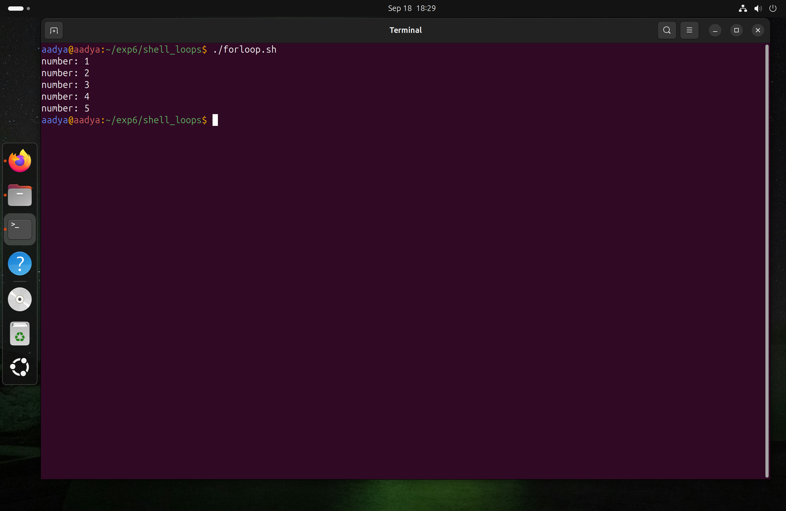
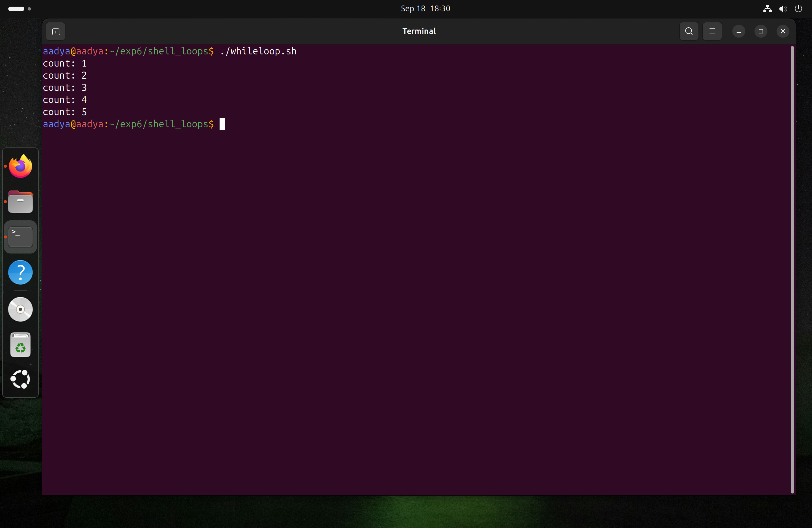
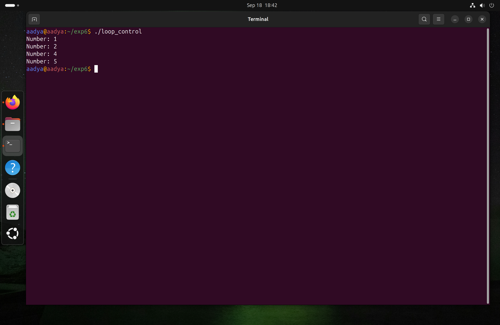
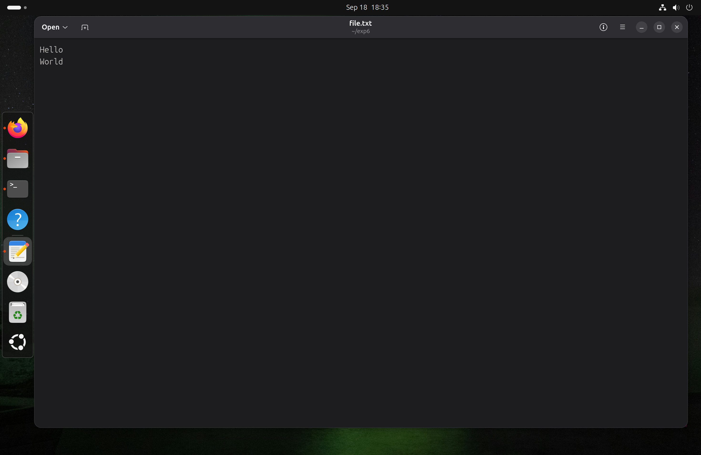
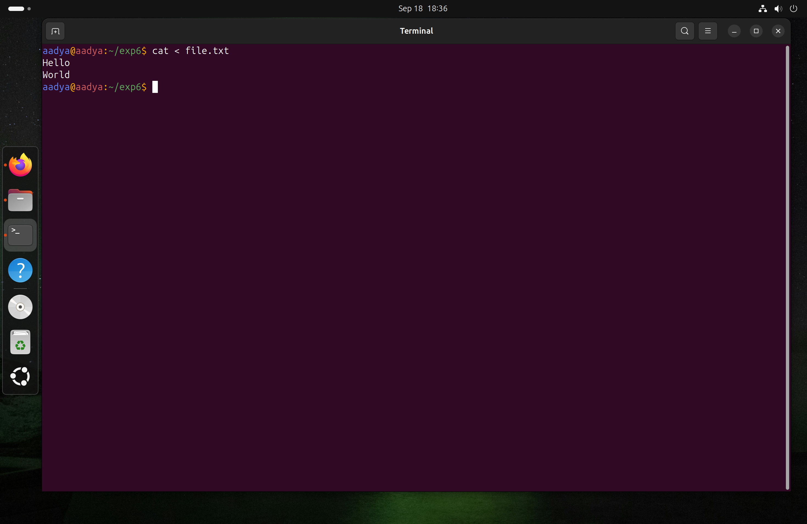
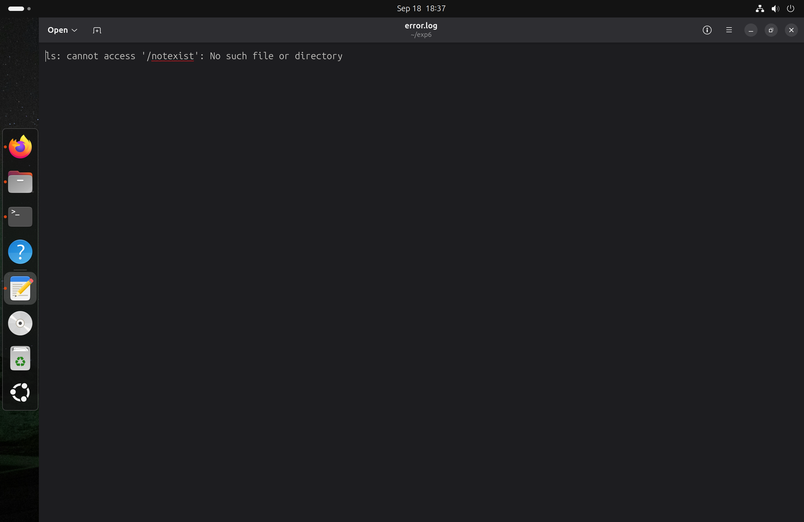
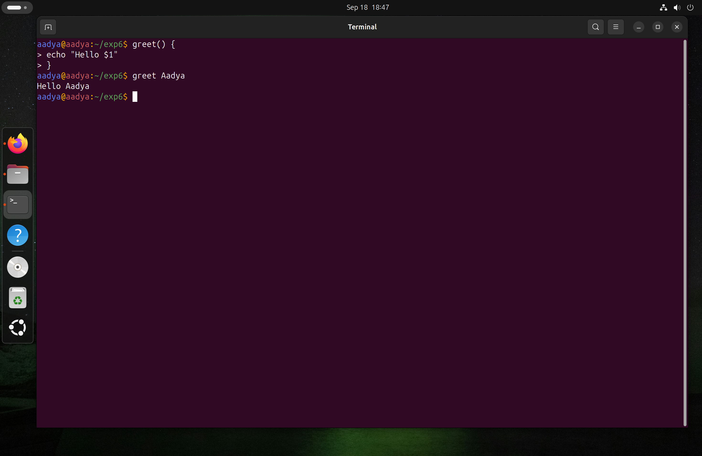
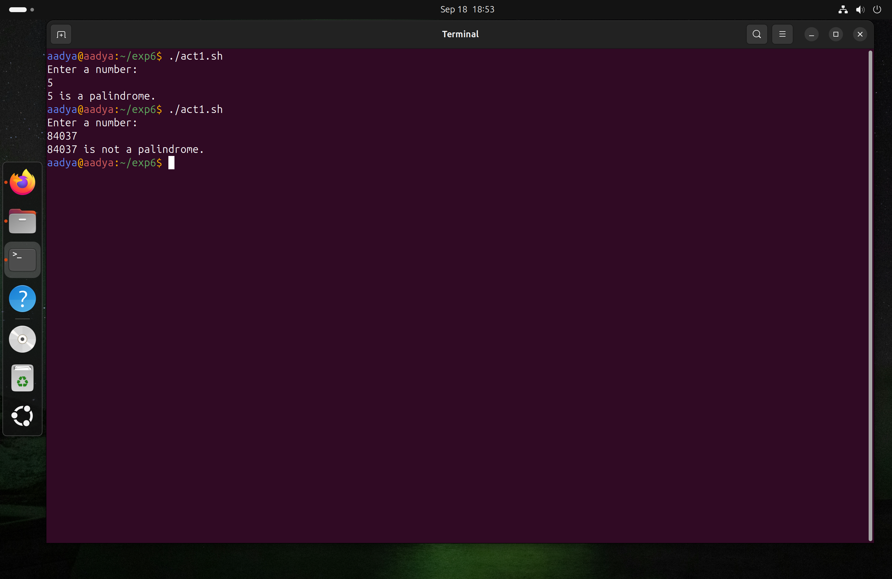
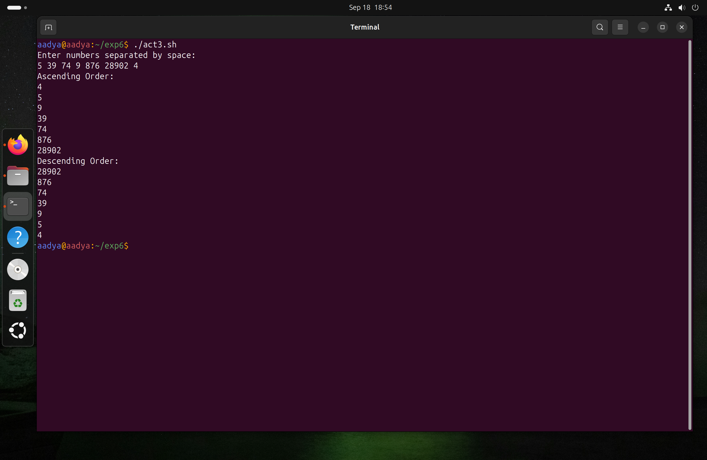

# Experiment 6: Shell Programming
**Name:** Aadya Dubey  
**Roll No.:** 590029213  
**Date**:20/09/2025
***
# Aim: 
To understand and practically apply Shell Loops, Loop Control statements, Input/Output Redirections, Shell Functions, Regular Expressions, and Script Debugging in Linux

# Requirments:
* Operating System: Ubuntu running on Oracle VirtualBox
* Shell: Bash (Bourne-Again Shell)
***
***

## 1. Shell Loops
Loops are used to execute a block of code repeatedly.

### For Loop
```bash
for i in 1 2 3 4 5
do
    echo "Number: $i"
done
```
### Output


### While Loop
```bash
i=1
while [ $i -le 5 ]
do
    echo "Count: $i"
    i=$((i+1))
done
```
### Output


### Until Loop
```bash
i=1
until [ $i -gt 5 ]
do
echo "Count: $i"
i=$((i+1))
done
```
### Output


The for loop iterates over items, while runs until the condition becomes false, and until runs until the condition becomes true. 

## 2. Loop Control
* break: exit from the loop.
* continue: skip current iteration and continue with the next. 

Example:
```bash
for i in {1..5}
do
    if [ $i -eq 3 ]; then
        continue
    fi
    echo "Number: $i"
done
```
### Output


## 3. I/O Redirection

Redirects output, input, or errors.

* `>` : redirect output (overwrite).
*  `>>`: append output.
*   `<` : redirect input.
*   `2>`: redirect errors. 

Examples:
```bash
echo "Hello" > file.txt
echo "World" >> file.txt
cat < file.txt
ls /notexist 2> error.log
```
### Output




## 4. Shell Functions
Functions allow code reuse and modularity.
```bash
greet() {
    echo "Hello $1"
}
greet "User"
```
### Output
Here`$1` refers to the first argument passed to the function. 



***
## Lab Exercises
### i. Palindrome Check
#### Script
```bash
#!/bin/bash
echo "Enter a number: "
read num
rev=0
temp=$num

while [ $temp -gt 0 ]
do
    digit=$((temp % 10))
    rev=$((rev * 10 + digit))
    temp=$((temp / 10))
done

if [ $num -eq $rev ]
then
    echo "$num is a palindrome."
else
    echo "$num is not a palindrome."
fi
```
Explanation: Digits are extracted one by one using `% 10`. They are combined in reverse order. The reversed number is compared with the original.
#### Output



### ii. GCD and LCM
#### Script
```bash
#!/bin/bash
echo "Enter two numbers: "
read a b

x=$a
y=$b
while [ $y -ne 0 ]
do
    temp=$y
    y=$((x % y))
    x=$temp
done
gcd=$x

lcm=$(( (a * b) / gcd ))

echo "GCD: $gcd"
echo "LCM: $lcm"
```
Explanation: The Euclidean algorithm is used for GCD. LCM is calculated using the formula `(a*b)/GCD`.
#### Output


### iii. Sorting Numbers
#### Script
```bash
#!/bin/bash
echo "Enter numbers separated by space: "
read -a arr

echo "Ascending Order: "
printf "%s\n" "${arr[@]}" | sort -n

echo "Descending Order: "
printf "%s\n" "${arr[@]}" | sort -nr
```
Explanation: `read -a` stores input in an array. `sort -n` arranges numbers in ascending order, and `sort -nr` in descending order. 
#### Output


***
# OBERVATIONS
* Loops and loop control statements executed correctly.
* Shell functions allowed reusable code blocks.

***

# CONCLUSION
Learned to use loops, functions, IO redirection, and regex in Bash scripts


***
