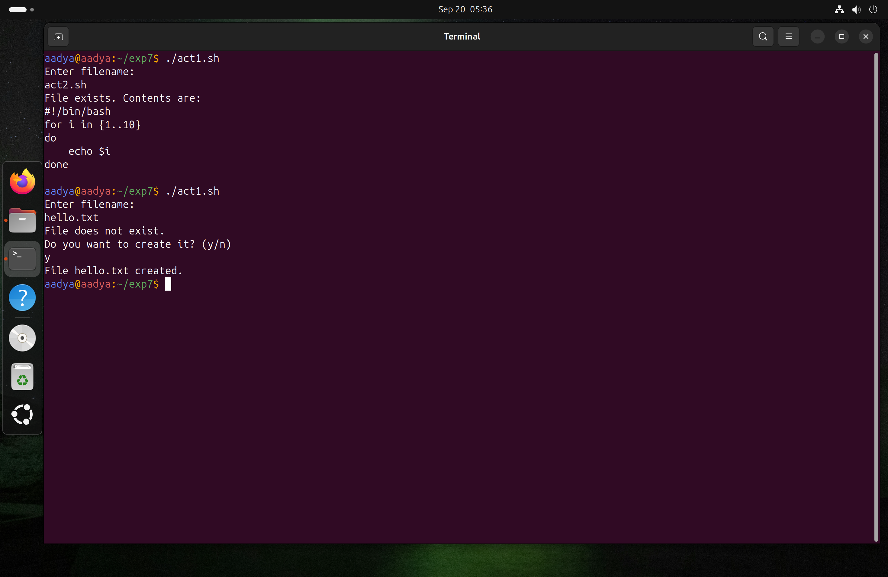
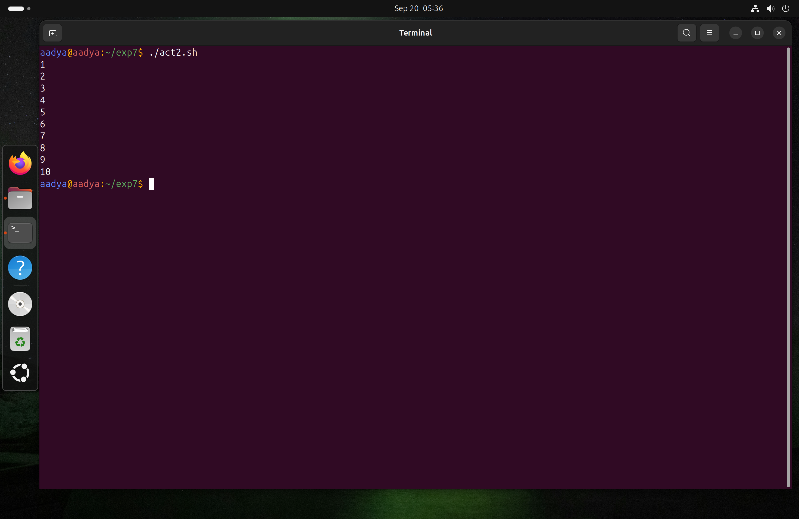
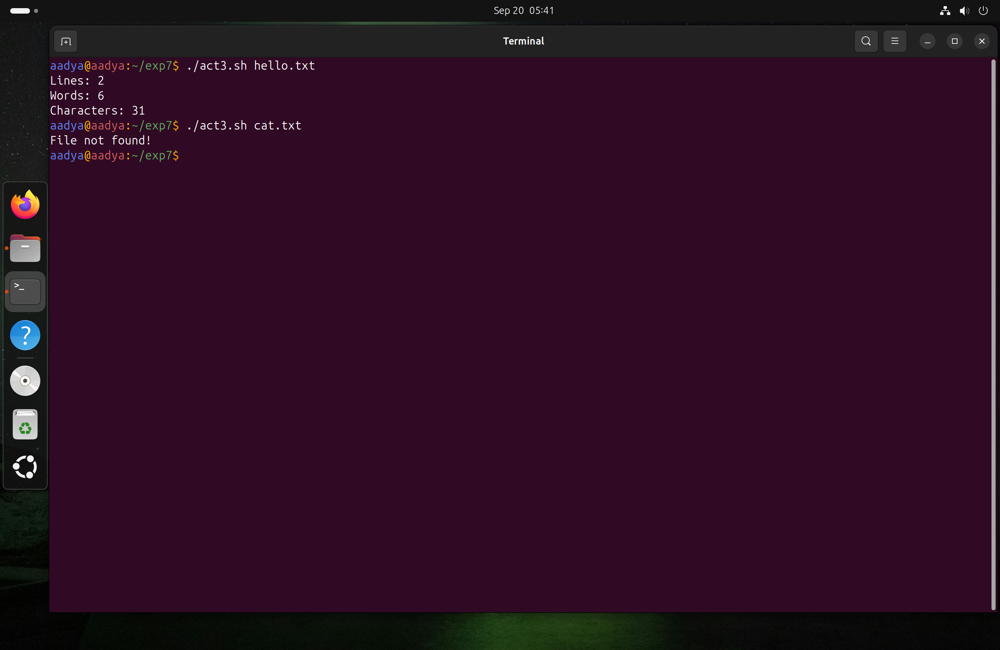
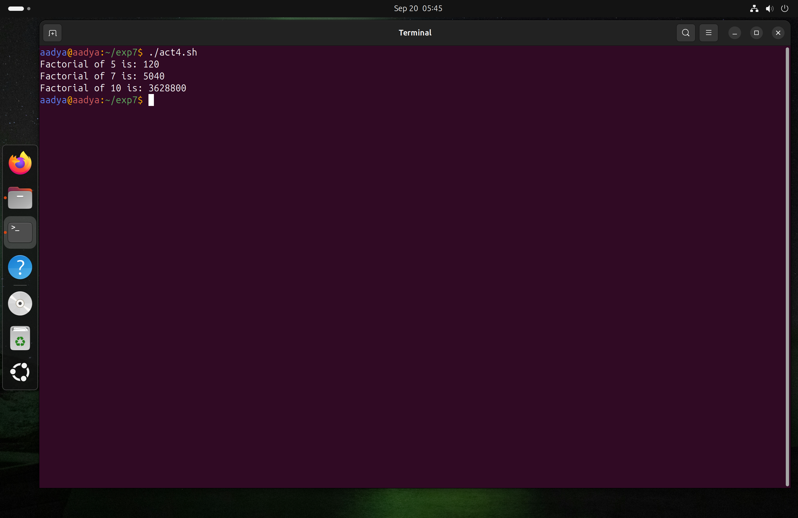

# Experiment 7: Shell Programming
**Name:** Aadya Dubey  
**Roll No.:** 590029213  
**Date**:25/09/2025
***
# Aim: 
To understand and practically apply process management commands, viewing and monitoring processes, terminating, process priortization and scheduling

# Requirments:
* Operating System: Ubuntu running on Oracle VirtualBox
* Shell: Bash (Bourne-Again Shell)
***
***

## Basic Process Commands
### 1.`ps`: Shows currently running processes


### 2. `top`: Displays dynamic list of running processes, their CPU and memory usage


### 3. `pstree`: Displays process hierarchy


### 4. `kill <PID>`: Stops a process


### 5. `kill -9 <PID>`: Forcefully kills a process

## Process Prioritization

Every process has a priority (nice value). Lower values = higher priority. Range: -20 (highest) to +19 (lowest).

### 1. `nice -n <value> command`: Start a process with a specific priority


### 2. `renice <value> -p <PID>`: Change priority of a running process

## Scheduling Processes
### 1. Command: `at [time]`: Schedules one-time tasks


### 2. Command: `cron`: Schedules recurring tasks using a crontab file

***
## Lab Exercises
### i. Check if File Exists
#### Script:
```bash
#!/bin/bash
echo "Enter filename: "
read file

if [ -e "$file" ]
then
    echo "File exists. Contents are:"
    cat "$file"
else
    echo "File does not exist."
    echo "Do you want to create it? (y/n)"
    read choice
    if [ "$choice" = "y" ]; then
        touch "$file"
        echo "File $file created."
    fi
fi
```
#### Output:



### ii. Print Numbers from 1 to 10
#### Script:
```bash
#!/bin/bash
for i in {1..10}
do
    echo $i
done
```
#### Output:


### iii. Count Lines, Words, and Characters
#### Script:
```bash
#!/bin/bash
if [ $# -eq 0 ]
then
    echo "Usage: $0 filename"
    exit 1
fi

file=$1

if [ -e "$file" ]
then
    echo "Lines: $(wc -l < $file)"
    echo "Words: $(wc -w < $file)"
    echo "Characters: $(wc -m < $file)"
else
    echo "File not found!"
fi
```
#### Output:


### iv. Factorial Using Function
#### Script:
```bash
#!/bin/bash
factorial() {
    num=$1
    fact=1
    while [ $num -gt 1 ]
    do
        fact=$((fact * num))
        num=$((num - 1))
    done
    echo $fact
}

echo "Factorial of 5 is: $(factorial 5)"
echo "Factorial of 7 is: $(factorial 7)"
echo "Factorial of 10 is: $(factorial 10)"
```
#### Output:

***
# OBERVATIONS
* Successfully viewed running processes using ps, top, and pstree.

* Able to terminate processes using kill and control their priority with nice and renice.

* Scheduled tasks using at for one-time execution and cron for recurring jobs.

***

# CONCLUSION
The experiment enhanced understanding of Linux process management and scheduling.


***
