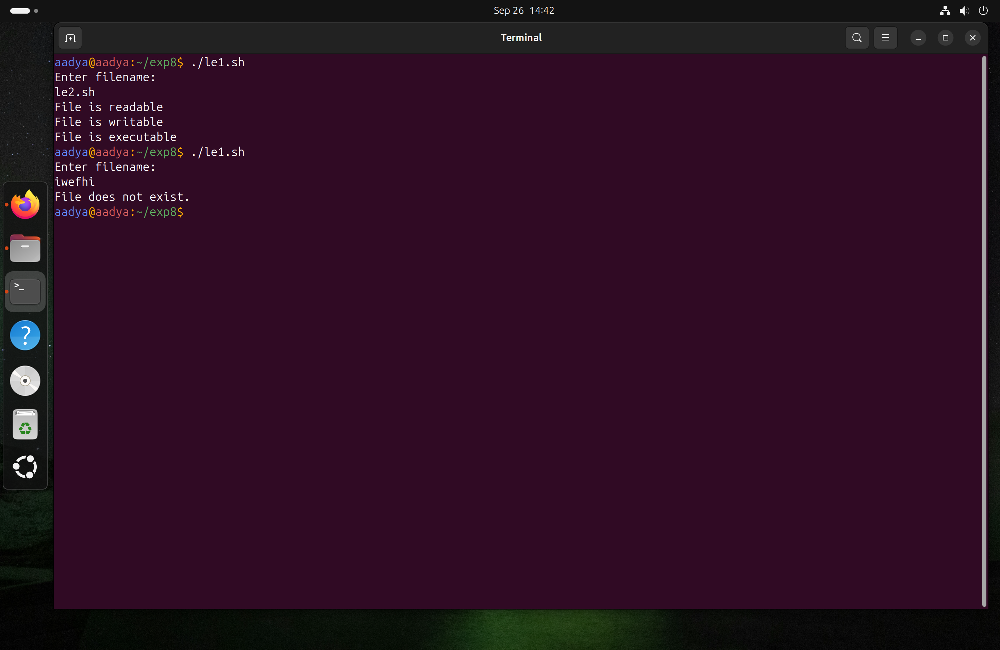
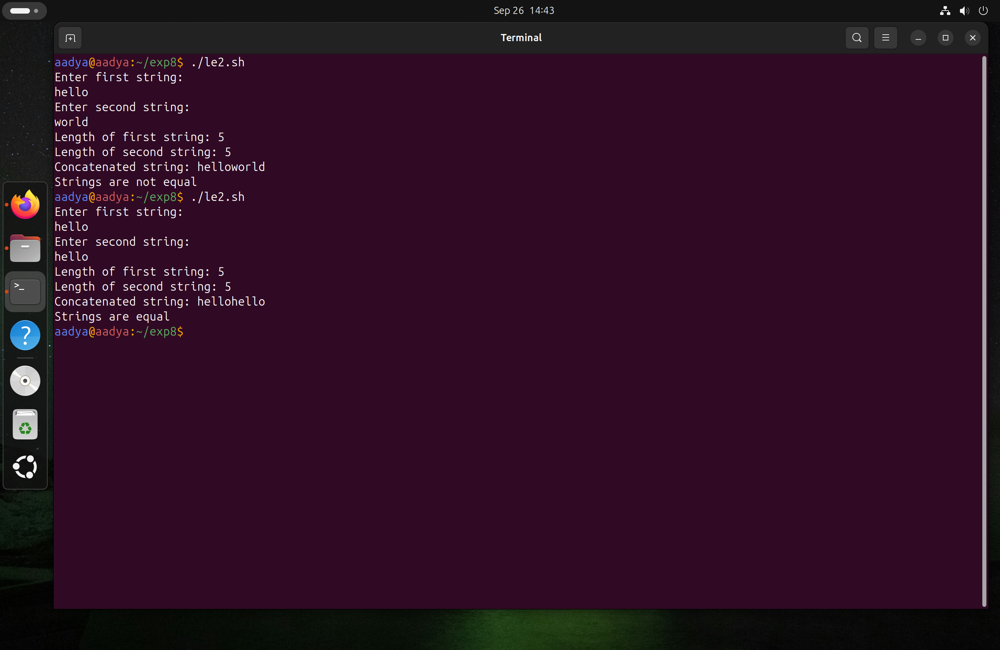
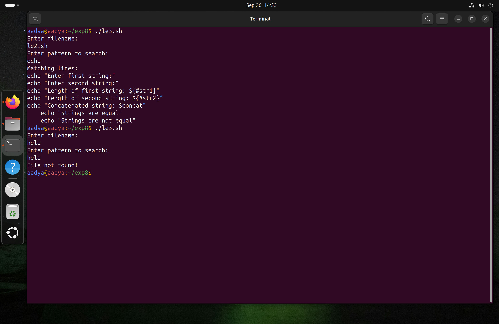
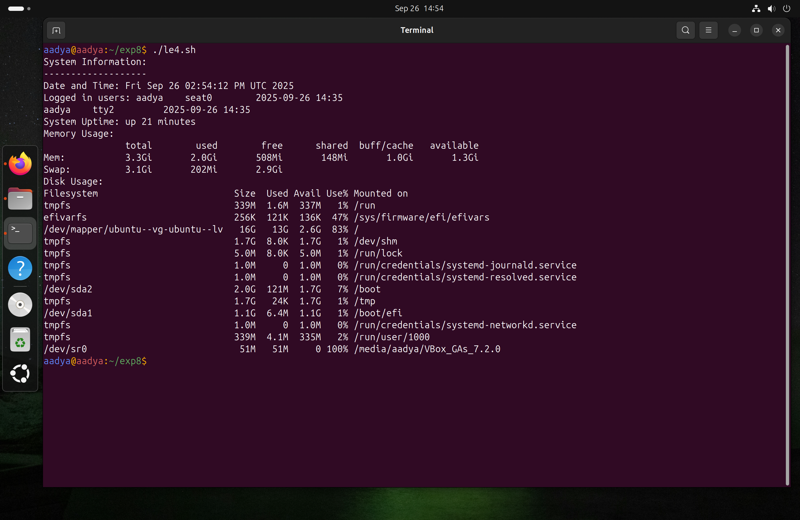

# Experiment 8: Shell Programming
**Name:** Aadya Dubey  
**Roll No.:** 590029213  
**Date**:29/09/2025
***
# Aim: 
To understand and demonstrate the concepts of process control and signals, process monitoring and resource usage, process communication and synchronization, background processes and job control, and system monitoring and logging in Linux.


# Requirments:
* Operating System: Ubuntu running on Oracle VirtualBox
* Shell: Bash (Bourne-Again Shell)
***
***


## Process Control and Signals
Processes can receive signals from the OS or the user to control execution.

### 1.`kill` → list all signals.
* Common signals:
	*  `SIGINT (2)` → interrupt (Ctrl+C).
	*  `SIGTERM (15)` → terminate gracefully.
	*  `SIGKILL (9)` → force kill.


* Syntax:
```bash
kill [options] <PID>
```
#### Output:


## Process Monitoring and Resource Usage

### 1. `top` → live view of processes, CPU, memory
#### Output:
### 2. `htop` (if installed) → user-friendly version of `top`
#### Output:
### 3. `ps aux` → snapshot of all processes
#### Output:
### 4. `free -h` → shows memory usage
#### Output:
###  5. `uptime` → system load averages
#### Output:

## Process Communication

Processes communicate using files, pipes, or sockets.

### 1. `Pipes (|)` → pass output of one command to another.
#### Output:

## Process Synchronization

To prevent conflicts, processes can be synchronized:
### 1. `wait` → wait for a background job to finish.
#### Script:
```bash
#! /bin/bash
echo " Starting processes"
nice -n 4 sleep 5 & PID1=$!
echo " sleep 5 is completed with PID = $PID1 "
nice
-n 6 sleep 3 &
PID2=$! wait
echo " sleep 3 is completed with PID = $PID2
nice
-n 7 sleep 7 &
PID3=$! wait
echo " sleep 7 is completed with PID = $PID3 "
echo " All the processes are completed "
#end
```
#### Output:

## Background Processes and Job Control

* Add `&` at the end to run command in background.
```bash
sleep 30 &
```
* `jobs` → shows background jobs.
* `fg %1`→ bring job 1 to foreground.
* `bg %1` → resume job 1 in background.
### Output:

## System Monitoring and Logging

### 1. `dmesg | less` → kernel/system messages
#### Output:
### 2. `journalctl` (systemd systems) → system logs
#### Output:
### 3. `last` → last logged-in users
#### Output:
### 4. `who` or `w` → users currently logged in
#### Output:

***
## Lab Exercises
### i. Check File Permissions
#### Script:
```bash
#!/bin/bash
echo "Enter filename:"
read file

if [ -e "$file" ]; then
    [ -r "$file" ] && echo "File is readable"
    [ -w "$file" ] && echo "File is writable"
    [ -x "$file" ] && echo "File is executable"
else
    echo "File does not exist."
fi
```
#### Output:



### ii. String Operations
#### Script:
```bash
#!/bin/bash
echo "Enter first string:"
read str1
echo "Enter second string:"
read str2

# String length
echo "Length of first string: ${#str1}"
echo "Length of second string: ${#str2}"

# Concatenation
concat="$str1$str2"
echo "Concatenated string: $concat"

# Comparison
if [ "$str1" = "$str2" ]; then
    echo "Strings are equal"
else
    echo "Strings are not equal"
fi
```
#### Output:



### iii. Search for a Pattern in a File
#### Script:
```bash
#!/bin/bash
echo "Enter filename:"
read file
echo "Enter pattern to search:"
read pattern

if [ -e "$file" ]; then
    echo "Matching lines:"
    grep "$pattern" "$file"
else
    echo "File not found!"
fi
```
#### Output:



### iv. Display System Information
#### Script:
```bash
#!/bin/bash
echo "System Information:"
echo "-------------------"
echo "Date and Time: $(date)"
echo "Logged in users: $(who)"
echo "System Uptime: $(uptime -p)"
echo "Memory Usage:"
free -h
echo "Disk Usage:"
df -h
```
#### Output:

***
# OBERVATIONS
* `kill`, `wait` and job control commands (`&`, `jobs`, `fg`, `bg`) worked as expected.

* `top`, `htop`, `ps aux` and `free -h` provided real-time process and resource information.

* Pipes (`|`) enabled inter-process communication.

* System monitoring commands (`dmesg`, `journalctl`, `last`, `who`) displayed logs and user activity correctly.

* Lab exercises executed successfully with expected outputs.

***

# CONCLUSION
* The experiment demonstrated process control, monitoring, communication, and synchronization in Linux.

* Background job management and system monitoring help efficiently manage processes.

* Shell scripting with process commands enables effective automation and resource tracking.

  ***

